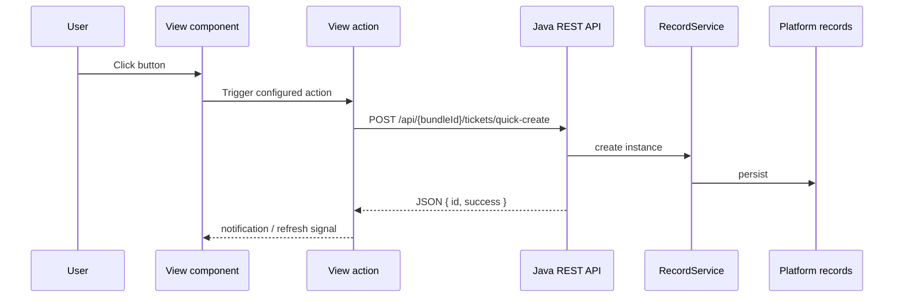
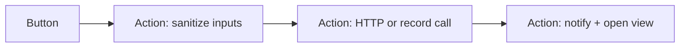
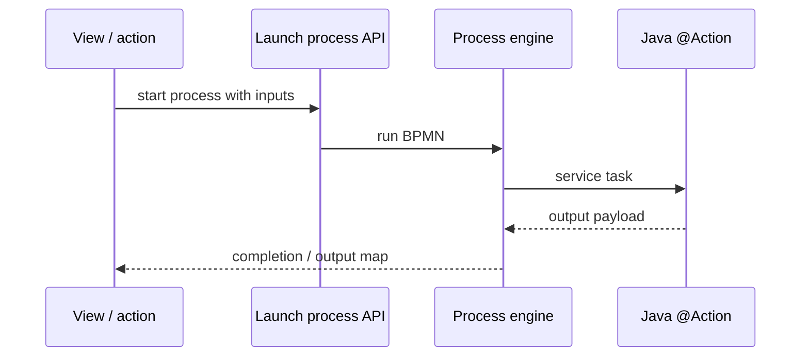

<!--
  @generated
  @context User requested composite examples where multiple Helix coded artifacts work together; added copy-paste Cursor/Agent prompts for each composite pattern.
  @decisions Scenario doc plus per-pattern agent prompts (read-first, deliverables, acceptance); record-create rules from AGENTS.md; view-designer-only steps called out where code cannot bind actions.
  @references cookbook/02-04, 06-07, AGENTS.md, ./cursor-prompts-coded-components.md
  @modified 2026-03-20
-->

# Composite coded examples (multi-artifact patterns)

These scenarios show how **more than one** coded piece fits together: view components, view actions, Angular services, Java APIs, processes, and definitions. Use them when designing features, writing Cursor prompts, or reviewing architecture.

**Cookbook pointers:** [View components](../../cookbook/02-ui-view-components.md) · [View actions](../../cookbook/03-ui-view-actions.md) · [Services & APIs](../../cookbook/04-ui-services-and-apis.md) · [Java backend](../../cookbook/06-java-backend.md) · [Process definitions](../../cookbook/07-process-definitions.md)

**Related:** [Cursor prompts for single artifacts](./cursor-prompts-coded-components.md) · [Helix coded apps tutorial](./helix-coded-apps-tutorial.md)

**Agent prompts:** Ready-to-paste Composer/Agent instructions for every pattern are in [Agent prompts (copy-paste)](#agent-prompts-copy-paste) below.

---

## 1. View component → button → view action → Java REST → create record

**Problem:** A dashboard tile has a **Create quick ticket** button. Clicking it must run **server-side validation and enrichment**, then **create a record** in your record definition.

**Artifacts involved**

| Layer | Pieces |
|--------|--------|
| UI | Standalone **view component** (Adapt button + status area) |
| UI | **View action** (invoked by button; builds HTTP request, handles response) |
| Server | **REST resource** (`RestfulResource`) — `@RxDefinitionTransactional` on methods |
| Metadata | **Record definition** `.def` (schema you write to) |

**Flow**



**Why include REST?** Centralizes rules (permissions, defaults, cross-field validation) in one place and keeps the component thin. **Alternative:** the view action can call **`RxRecordInstanceService`** directly from Angular and skip custom REST—fewer moving parts, but less reuse for non-UI callers.

**Platform reminders (record create):** Set **Status (field 7)** and **Description (field 8)** on creation; use **epoch millis** for dates in Java ([AGENTS.md](../../AGENTS.md)).

---

## 2. View action chain → transform → call API → notify

**Problem:** One button should **normalize input**, **call an endpoint**, then **show a toast**; a later action in the chain **opens another view** with the returned id.

**Artifacts involved:** **View action** (×3 registered actions) · optional **Java REST** or platform services · **`RxOpenViewActionService`** / **`RxNotificationService`**

**Flow**



**Composite idea:** Action 1 outputs fields consumed by action 2’s expression bindings in View Designer; action 3 runs only if 2 succeeds. Same pattern works with **only platform APIs** (no Java) if action 2 uses `RxRecordInstanceService` or DataPage.

---

## 3. Shared Angular service + multiple view components

**Problem:** A **header** component shows a count and a **list** component shows rows; both must stay in sync after any refresh.

**Artifacts involved:** **Angular service** (state + `BehaviorSubject` or similar) · two (or more) **standalone view components** · optional **view action** that calls `service.refresh()` after mutations.

**Flow:** Components inject the same service; service exposes `state$` and methods; **no duplicate HTTP** in each component. Good composite for **dashboards** and **master–detail** style layouts built from multiple custom components on one view.

---

## 4. View component → launch process → Java `@Action` → side effects

**Problem:** The UI must **start a controlled workflow** (audit trail, synchronous server steps, reusable from rules) rather than a single REST call.

**Artifacts involved:** **View component** or **view action** using **`RxLaunchProcessViewActionService`** · **process definition** `.def` · **Java process activity** (`@Action`) · optional **record definitions**

**Flow**



**Composite value:** Same `@Action` can be reused from **processes, rules, and other integrations**; the `.def` owns orchestration. Remember: deploy **JAR before** process `.def` to avoid **ERROR 930** ([process cookbook](../../cookbook/07-process-definitions.md)).

---

## 5. Custom DataPage: Java DataPageQuery + view component + DataPage POST

**Problem:** A grid needs rows from **custom server logic** (not a plain record query).

**Artifacts involved:** **Java DataPageQuery** · **view component** (Adapt table or list) · **`HttpClient`** call to **DataPage API** (often wrapped in an **Angular service**) per [Services & APIs](../../cookbook/04-ui-services-and-apis.md)

**Flow:** Component → service `loadPage(cursor)` → POST DataPage with query name your bundle registers → Java builds page → UI renders. Composite across **Angular + Java + platform DataPage infrastructure**.

---

## 6. Record editor field component + “Set property” on a sibling component

**Problem:** Changing a **field** should **show/hide or reconfigure** another custom widget on the same view.

**Artifacts involved:** **Record editor field view component** · **standalone view component** with **`api.setProperty`** (see pizza-ordering pattern under `.cursor/_instructions/.../pizza-ordering/`) · **view action** “Set property” configured in View Designer

**Flow:** User changes field → rule or explicit action chain → **Set property** targets the standalone component’s `api`. Links **field-level** UX to **canvas-level** components without tight Angular coupling in code (configuration-driven in the view definition).

---

## 7. View component → internal REST → Command (fire-and-forget)

**Problem:** Click should **trigger a server action** where the UI only needs **HTTP 204/200**, not a rich body—e.g. **audit log append** or **cache invalidation** implemented as a **Command**.

**Artifacts involved:** **View component** · **view action** (`HttpClient`) · **Java Command** · optional thin **REST** method that invokes the command handler (if your SDK pattern routes commands through REST) or direct command endpoint as documented in `.cursor/_instructions/Java/ObjectTypes/command.md`

**Composite idea:** Separates **idempotent reads** (REST GET) from **fire-and-forget writes** (command), useful when the UX must not block on heavy downstream work beyond acknowledgment.

---

## 8. Process + UI: create record via `@Action`, then open detail view

**Problem:** After server creates or updates data, the user should **land on a detail view** with the new id.

**Artifacts involved:** **Process** `.def` + **Java @Action** (returns new id) · **view action** with **`RxOpenViewActionService`** using output from **`RxLaunchProcessViewActionService`** (or chained actions: launch process → open view with mapped outputs)

**Composite value:** Keeps **creation logic on the server** while **navigation stays in Angular**, with outputs bridged through the action chain or process result mapping.

---

## Summary table

| # | Pattern | Primary UI | Primary server | Definition `.def` |
|---|---------|------------|----------------|-------------------|
| 1 | Quick create via REST | View component + view action | REST + RecordService | Record |
| 2 | Multi-step button | View action chain | Optional REST / records | — |
| 3 | Shared dashboard state | Multiple VCs + service | Optional | — |
| 4 | Audited workflow | Launch process | `@Action` | Process |
| 5 | Custom grid data | VC + service + HttpClient | DataPageQuery | — |
| 6 | Field drives canvas | Record field VC + Set property | — | View |
| 7 | Fire-and-forget | VC + view action | Command (+ REST if needed) | — |
| 8 | Create then navigate | View action(s) | `@Action` | Process + View |

---

## Suggested order to implement

1. **Record definition** (if not already present).
2. **Java REST** or **`@Action`** (whichever your pattern uses).
3. **View action** (HTTP or launch process).
4. **View component** (button binds to action in View Designer).
5. **Process .def** (only for pattern 4 / 8).
6. **View .def** (layout, bindings, action chain).

Use the **Agent prompts** section below for copy-paste instructions. You can still combine [single-artifact prompts](./cursor-prompts-coded-components.md) when you prefer smaller steps.

---

## Agent prompts (copy-paste)

**How to use:** Open your Helix coded-app repo in Cursor. In **Composer** or **Agent**, paste **one** prompt below. Attach the listed `@` files (add `@how-to-build-coded-component-examples/composite-coded-examples.md` so the model sees the matching diagram section). Prefer **one composite per session** to keep diffs reviewable.

**General constraints (all composites):** Follow `@AGENTS.md` and `@.cursor/rules/generation-context-comments.mdc`. Angular: `standalone: true`, `OnPush`, `@if`/`@for`, `RxLogService`, localization via `localized-strings.json` + `TranslateService`, `takeUntil(this.destroyed$)` on subscriptions. Java: register new services in `MyApplication.java` **before** `registerStaticWebResource()`; record creates set **Status (7)** and **Description (8)**; dates as **epoch millis**; `@RxDefinitionTransactional` **only** on REST endpoints, not on `@Action` methods invoked only from processes/rules.

### Composite 1 — View component + view action + REST + record create

```text
Implement **composite pattern #1** from @how-to-build-coded-component-examples/composite-coded-examples.md (view component → view action → Java REST → create record).

Read first:
- @cookbook/02-ui-view-components.md
- @cookbook/03-ui-view-actions.md
- @cookbook/04-ui-services-and-apis.md
- @cookbook/06-java-backend.md
- @AGENTS.md
- @.cursor/rules/generation-context-comments.mdc

Goal: Standalone view component `quick-ticket-tile` with an Adapt button "Create quick ticket" that triggers a registered view action. The view action POSTs JSON to a new REST endpoint `POST /api/{bundleId}/tickets/quick-create` with body { title: string }. The Java REST resource creates one record instance in record definition `<bundleId>:Quick Ticket>` (create the record .def if missing) with Title from body, Status and Description set per AGENTS.md, and returns { success, recordId, errorMessage }.

Deliverables:
- Record definition .def under package definitions path used by this repo (match sibling .def format).
- Java: REST class + small request/response DTOs; use RecordService for create; register in MyApplication.
- Angular: view action `quick-ticket-create` using HttpClient with correct Helix headers per cookbook; view component with localized strings; full registration and module wiring per existing project patterns.

Acceptance: Build succeeds; no console.log; types aligned; View Designer can bind button → action (document exact action name and REST path in a short README comment block in the view action file only if needed).
```

### Composite 2 — View action chain (sanitize → call → notify + open view)

```text
Implement **composite pattern #2** from @how-to-build-coded-component-examples/composite-coded-examples.md (three-step view action chain).

Read first:
- @cookbook/03-ui-view-actions.md
- @cookbook/04-ui-services-and-apis.md (RxNotificationService, RxOpenViewActionService)
- @cookbook/09-best-practices.md
- @AGENTS.md
- @.cursor/rules/generation-context-comments.mdc

Goal: Three registered view actions:
(1) `normalize-ticket-title` — input rawTitle (string), output cleanedTitle (trim, collapse spaces, max 120 chars).
(2) `echo-ticket-stub` — input cleanedTitle (string), output ticketId (string) using a deterministic stub "STUB-" + first 8 chars of a simple hash or length (no real HTTP required).
(3) `notify-and-open-stub` — input ticketId; shows RxNotificationService success; calls RxOpenViewActionService with a **placeholder** view name constant clearly marked TODO for authors to replace in View Designer (document that the view id must match a deployed Innovation Studio view).

Wire outputs so each action’s outputs can feed the next via View Designer expression binding (parameter names documented in design models).

Deliverables: Three action folders under actions/, three registration modules, main module imports.

Acceptance: Each execute returns Observables suitable for chaining; localized notification message; no console.log.
```

### Composite 3 — Shared service + two view components

```text
Implement **composite pattern #3** from @how-to-build-coded-component-examples/composite-coded-examples.md (shared Angular service + two standalone view components).

Read first:
- @cookbook/02-ui-view-components.md
- @cookbook/04-ui-services-and-apis.md
- @cookbook/09-best-practices.md
- @AGENTS.md
- @.cursor/rules/generation-context-comments.mdc

Goal: Injectable `DashboardTicketsStateService` holding { totalCount: number, items: { id: string; title: string }[] } exposed as a readonly observable API + `loadStubData()` that sets 3 fake items and totalCount=3 + `clear()`. Two standalone view components: `dashboard-tickets-header` displays totalCount; `dashboard-tickets-list` displays titles in an Adapt list or simple repeated @for. Both inject the service and subscribe with takeUntil(destroyed$). Optional third piece: view action `dashboard-tickets-refresh` that only calls `loadStubData()` (for button binding in View Designer).

Deliverables: Service + provider module pattern matching this repo; two view component folders with registration; optional refresh action.

Acceptance: Both components update when refresh action runs; OnPush + markForDetect or async pipe as appropriate; localized UI strings.
```

### Composite 4 — Launch process + process .def + Java @Action

```text
Implement **composite pattern #4** from @how-to-build-coded-component-examples/composite-coded-examples.md (UI launches BPMN process calling Java @Action).

Read first:
- @cookbook/03-ui-view-actions.md
- @cookbook/04-ui-services-and-apis.md (RxLaunchProcessViewActionService)
- @cookbook/06-java-backend.md
- @cookbook/07-process-definitions.md
- @AGENTS.md
- @.cursor/rules/generation-context-comments.mdc

Goal: Java @Action `auditQuickTicket` with input note (String), output confirmationId (String) stub "CONF-" + System.currentTimeMillis(). Register service in MyApplication. Author process definition `auditQuickTicketProcess` per cookbook (Start → ServiceTask → End) with actionTypeName `<bundleId>:auditQuickTicket`, correct input/output maps and GUID rules. View action `launch-audit-quick-ticket` that uses RxLaunchProcessViewActionService to start `<bundleId>:auditQuickTicketProcess` with the note parameter; surface success/failure via RxNotificationService.

Constraints: Do not add @RxDefinitionTransactional to the @Action if it is only for process invocation. Deploy order: document JAR before .def in a comment on the .def file.

Deliverables: Java activity + response DTO; process .def; view action + registration.

Acceptance: actionTypeName matches Java; process file line prefix rules satisfied; compiles.
```

### Composite 5 — DataPageQuery + service + view component (grid)

```text
Implement **composite pattern #5** from @how-to-build-coded-component-examples/composite-coded-examples.md (Java DataPageQuery + Angular DataPage call + view component).

Read first:
- @cookbook/04-ui-services-and-apis.md (DataPage POST)
- @cookbook/06-java-backend.md (DataPageQuery)
- @.cursor/_instructions/Java/ObjectTypes/datapagequery.md
- @cookbook/02-ui-view-components.md
- @AGENTS.md
- @.cursor/rules/generation-context-comments.mdc

Goal: Java DataPageQuery registered in MyApplication returning a stub page of tickets { id, title } with pagination metadata. Angular service `TicketDataPageService` with method `fetchPage$()` calling POST `/api/rx/application/datapage` (or the exact pattern this repo uses) with the query identifier your Java registers. Standalone view component `ticket-datapage-grid` using Adapt table or list to display rows from the first page; include localized loading and empty states; RxLogService on errors.

Deliverables: DataPageQuery class + registration; Angular service; view component + registration.

Acceptance: Query name in TypeScript matches Java registration; HttpClient uses required headers from cookbook; subscriptions use takeUntil(destroyed$).
```

### Composite 6 — Record editor field + standalone component with `api.setProperty`

```text
Implement **composite pattern #6** from @how-to-build-coded-component-examples/composite-coded-examples.md (record field VC + sibling standalone VC with setProperty API).

Read first:
- @cookbook/02-ui-view-components.md (record editor field + standalone sections)
- @.cursor/_instructions/UI/ObjectTypes/Examples/StandaloneViewComponent/pizza-ordering/ (api.setProperty pattern)
- @docs/request-view-component-with-record-definition.md (if mapping to a real record field; under docs/)
- @AGENTS.md
- @.cursor/rules/generation-context-comments.mdc

Goal: (A) Standalone `priority-banner` with config message (string) and hidden (boolean), exposing api.setProperty for keys `message` and `hidden` like pizza-ordering. (B) Record editor field `priority-toggle-field` bound to an integer or character field (choose one and document) that represents priority 1–3; when value changes in ngOnChanges/runtime hook appropriate for record field pattern, call notifyPropertyChanged as required — **code cannot wire View Designer rules**; add a short markdown snippet in a comment block listing View Designer steps: on field change → Set property on `priority-banner` to update message text based on priority.

Deliverables: Both components fully registered.

Acceptance: setProperty works for message/hidden; record field follows cookbook lifecycle; document designer wiring in comments.
```

### Composite 7 — View action + REST + server-side fire-and-forget style

```text
Implement **composite pattern #7** from @how-to-build-coded-component-examples/composite-coded-examples.md (UI POST → REST → minimal response).

Read first:
- @cookbook/03-ui-view-actions.md
- @cookbook/06-java-backend.md (REST + optional Command)
- @.cursor/_instructions/Java/ObjectTypes/command.md (if implementing a true Command)
- @AGENTS.md
- @.cursor/rules/generation-context-comments.mdc

Goal: View action `submit-audit-event` POSTing { eventType: string, detail: string } to new REST resource `POST /api/{bundleId}/audit/events` returning 204 or JSON { accepted: true }. Java REST method uses @RxDefinitionTransactional; logs event with ServiceLocator.getLogger() at INFO; **no file I/O, no threads**. If command.md shows a cleaner pattern for the same behavior, you may implement a Command and invoke it from the REST method instead — register all services in MyApplication.

Deliverables: REST resource + DTOs; view action with HttpClient; optional Command class per SDK docs.

Acceptance: REST secured with @AccessControlledMethod like other resources in repo; localized client-side success/error toasts.
```

### Composite 8 — Launch process then open detail view (action chain or sequential)

```text
Implement **composite pattern #8** from @how-to-build-coded-component-examples/composite-coded-examples.md (process creates/returns id → navigate).

Read first:
- @cookbook/03-ui-view-actions.md
- @cookbook/04-ui-services-and-apis.md (RxLaunchProcessViewActionService, RxOpenViewActionService)
- @cookbook/06-java-backend.md
- @cookbook/07-process-definitions.md
- @AGENTS.md
- @.cursor/rules/generation-context-comments.mdc

Goal: Reuse or add Java @Action `createQuickTicket` returning newRecordId (string stub "REC-" + timestamp). Process .def `createQuickTicketFlow` mapping inputs/outputs. **Two view actions**: (a) `launch-create-quick-ticket` starts the process and outputs newRecordId from process result (map per platform API for launch). (b) `open-ticket-detail-stub` takes recordId and calls RxOpenViewActionService with placeholder view id constant marked TODO. Document in README-style comment: in View Designer, chain action (a) → action (b) mapping newRecordId to recordId parameter.

If the launch API returns results in a shape that requires a single combined action, implement one action that performs launch then open view with clear separation of concerns in private methods.

Deliverables: Java + process .def + one or two view actions + registrations.

Acceptance: Output of create path is available to a second action via chain; placeholders clearly marked; compiles.
```

---
