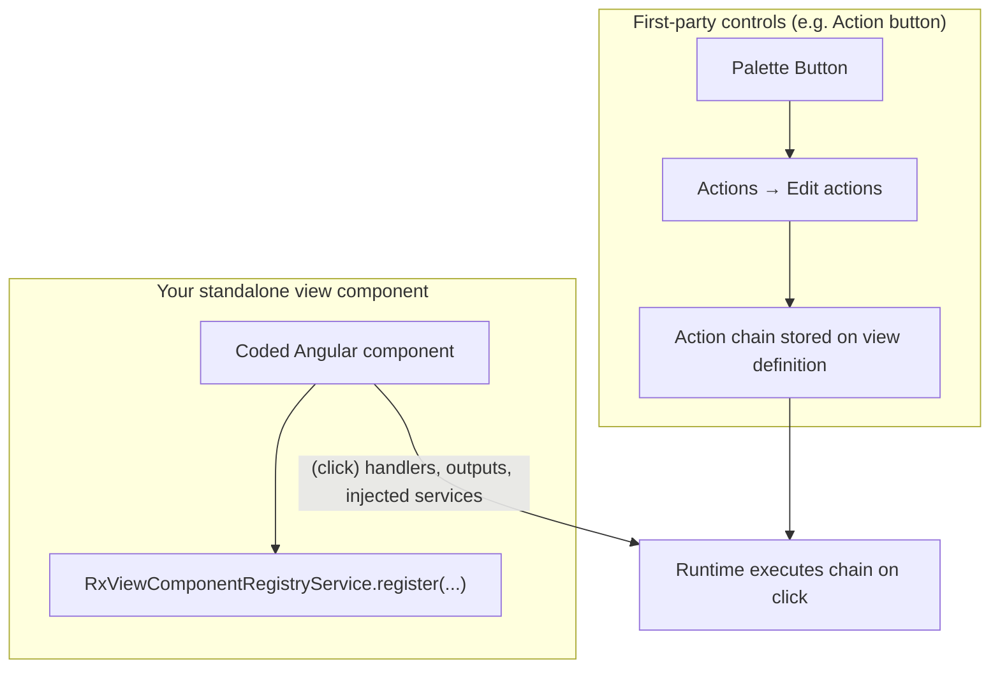
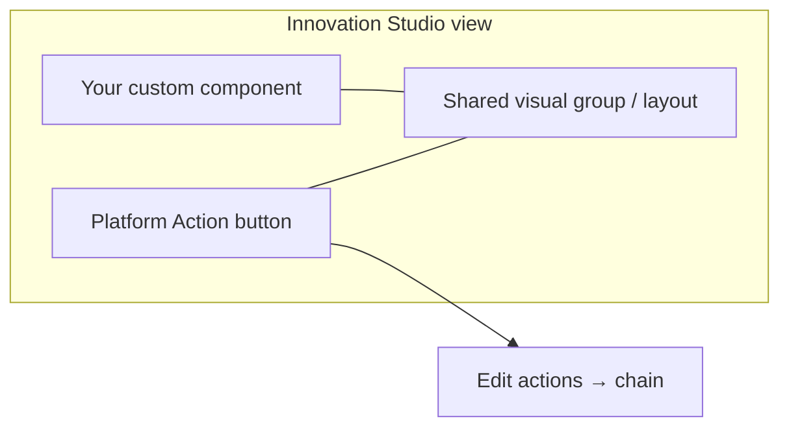
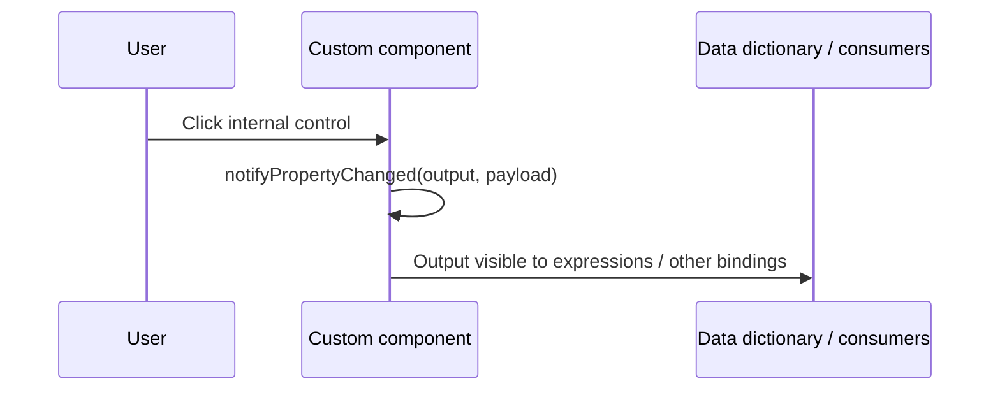

<!--
  @generated
  @context User wants a custom view component that supports View Designer–configurable view actions like the palette Button’s Edit actions; doc explains platform behavior, patterns, diagrams, Cursor prompt.
  @decisions Honest split: native controls vs custom registration; patterns A–C; SDK verification step; no unverified API claims.
  @references cookbook/02-ui-view-components.md, cookbook/03-ui-view-actions.md, .cursor/_instructions/UI/ObjectTypes/StandaloneViewcomponent/standalone-view-component.md, linking-view-actions-to-buttons.md
  @modified 2026-03-20
-->

# Custom view components and View Designer–configurable actions

This guide explains how **view action selection** (the same *idea* as the palette **Button → Actions → Edit actions** flow) relates to **coded standalone view components**, what the platform documentation in this repo covers, and **practical patterns** that give authors configurable behavior without fighting the framework.

---

## 1. What you are trying to achieve

| Goal | Meaning |
|------|---------|
| **Designer-driven** | Authors pick **which view actions** run (and in what order) **in View Designer**, not only in TypeScript. |
| **Hosted on your widget** | The click (or other trigger) originates from **your** component’s UI (e.g. internal toolbar button). |
| **Same mental model as palette Button** | **Available actions** → **Selected actions** → parameter binding via expressions. |

That is the correct target. The important question is whether **your custom component type** is allowed to host the **same configuration surface** as a first-party **Action button**.

---

## 2. Two different things in the platform



- **Palette Button:** The platform ships a control type whose **metadata** tells View Designer to show **Edit actions** and persist a **chain** on the view.
- **Custom view component:** The [standalone view component registration](../../.cursor/_instructions/UI/ObjectTypes/StandaloneViewcomponent/standalone-view-component.md) model in this repo documents **`type`, `name`, `group`, `icon`, `component`, `design*`, `properties`, `options`, `availableInBundles`**. It does **not** document an official **`actions`** (or equivalent) block that turns on the **same** Edit-actions modal for **arbitrary** custom components.

**Implication:** Treat **“full native Edit actions on my custom VC”** as **version- and SDK-dependent**. Before building, **inspect your Helix SDK typings** for `RxViewComponentRegistryService.register` (and related view-component descriptor types) in `@helix/platform/view/api` for your exact release. If the interface exposes optional action-chain or event hooks for custom components, use those; if not, use the patterns below.

---

## 3. What *is* fully supported for custom components (today’s cookbook)

| Mechanism | Use |
|-----------|-----|
| **`properties` + `enableExpressionEvaluation`** | Inspector fields and expression picker; runtime receives evaluated values on `config`. |
| **Settable properties + `api.setProperty`** | **Set property** view action can target your component (see pizza-ordering pattern). |
| **Output parameters / data dictionary** | `notifyPropertyChanged` + design model **`prepareDataDictionary`** so outputs appear for **expressions** and downstream wiring ([design-time doc](../../.cursor/_instructions/UI/ObjectTypes/StandaloneViewcomponent/standalone-view-component-design-time.md)). |
| **Injecting platform “action” services** | e.g. `RxOpenViewActionService`, `RxLaunchProcessViewActionService`, `RxNotificationService` — behavior is **coded**, parameters can still be **expression-driven** via `config`. |

So: you can always make a custom component **trigger the same *kinds* of work** (open view, launch process, notify). What is **not guaranteed** without SDK proof is exposing the **identical Edit-actions UI** on **your** component’s row in the outline.

---

## 4. Recommended patterns (same outcome, different wiring)

### Pattern A — Composition with a palette **Button** (most reliable)

Place your **custom component** and a **native Action button** on the view. Authors configure **Edit actions** on the **Button**. Visually group them (layout, labels, CSS) so it feels like one widget.



**Pros:** Identical **Edit actions** UX, chains, and save format as the rest of the platform. **Cons:** Two components in the tree; authors must keep them in sync (naming, visibility).

**Doc:** [Linking view actions to buttons](./linking-view-actions-to-buttons.md).

---

### Pattern B — **Outputs** from your component + view-level automation

Your component calls `notifyPropertyChanged('somethingClicked', payload)` (and defines that output in the design model). Other parts of the view—or platform rules/automation where applicable—react. This is **not** literally the Edit-actions list *inside* your inspector, but it is the **documented** way custom components **signal** the rest of the view.



**Pros:** Strong encapsulation; aligns with [output parameter guidance](../../.cursor/_instructions/UI/ObjectTypes/StandaloneViewcomponent/standalone-view-component-design-time.md). **Cons:** Authors may wire **Set property**, **other actions**, or expressions—not always the same “chain on this widget” metaphor.

---

### Pattern C — **Inspector-configured intent**, **runtime** maps to services

Add properties such as:

- `launchProcessName` (string, optional expression),
- `openViewName` (string),
- or a small set of **enum** behaviors (`none` | `openView` | `launchProcess`),

and in `(click)` call the matching **`RxLaunchProcessViewActionService` / `RxOpenViewActionService`** with parameters from `config`.

**Pros:** Single component; authors configure without opening **Edit actions**. **Cons:** You maintain the mapping; not every platform view action is representable unless you add more properties or a **generic** execution API (only if SDK provides one—verify, do not guess).

---

## 5. If the SDK later exposes “actions on custom component”

If `register({ ... })` (or a parallel API) gains documented support for attaching **action chains** to your component:

1. Follow **that** API’s shape exactly (names, descriptors, runtime hooks).
2. Runtime will likely receive **resolved chain definitions** or a **runner** service—implement **one** thin adapter in your component instead of re-implementing the whole executor.

Until confirmed in your SDK version, assume **Pattern A** for a **pixel-perfect** match to **Edit actions**.

---

## 6. Cursor / Agent prompt (investigate + implement)

Paste into Composer/Agent and attach the files below.

```text
You are working on a BMC Helix Innovation Studio coded application (Angular 18).

Read first:
- @docs/how-to-build-coded-component-examples/custom-view-component-with-designer-configured-actions.md
- @cookbook/02-ui-view-components.md
- @cookbook/03-ui-view-actions.md
- @.cursor/_instructions/UI/ObjectTypes/StandaloneViewcomponent/standalone-view-component.md
- @docs/how-to-build-coded-component-examples/linking-view-actions-to-buttons.md

Phase 1 — SDK reality check:
1. Locate the TypeScript definition for `RxViewComponentRegistryService.register` (or equivalent) in `@helix/platform/view/api` for this project’s SDK version.
2. Report in a short comment (in code or PR description): whether custom standalone view components can attach the same View Designer “Edit actions” / action-chain configuration as the palette Action button, and cite the symbol names you found.

Phase 2 — Implementation (choose based on Phase 1):
- If the SDK supports first-class action configuration on custom components: implement `<component-name>` using that API and document inspector steps for authors.
- If not: implement **Pattern A** — document that authors should place a platform **Action button** next to the component and use **Edit actions** on that button; OR implement **Pattern C** with inspector fields + `RxLaunchProcessViewActionService` / `RxOpenViewActionService` for a defined set of behaviors.

Constraints:
- standalone: true, OnPush, @if/@for, RxLogService, localization for user-visible strings, takeUntil(destroyed$), @generated headers per project rules.

Deliverables:
- Types, registration module, design + runtime files as per cookbook.
- Short README section: “How authors wire actions” (native button vs inspector fields).
```

---

## 7. Related docs

| Topic | Location |
|--------|-----------|
| **Runtime actions demo** — `actionSinks` + Edit actions picker (working example) | [RUNTIME-ACTIONS-DEMO-ARCHITECTURE.md](../../my-components/runtime-actions-demo/RUNTIME-ACTIONS-DEMO-ARCHITECTURE.md) |
| **Add rx-actions to existing component** — prompt for another agent | [add-rx-actions-to-existing-view-component.md](./add-rx-actions-to-existing-view-component.md) |
| Button **Edit actions** walkthrough | [linking-view-actions-to-buttons.md](./linking-view-actions-to-buttons.md) |
| View actions (code + registration) | [cookbook/03-ui-view-actions.md](../../cookbook/03-ui-view-actions.md) |
| Composite flows (button → action → REST, …) | [composite-coded-examples.md](./composite-coded-examples.md) |
| Triggering overview | [Triggering actions index](../triggering-actions-cookbook-index.md) |

---

*This document reflects the instructions and cookbook available in this repository; your installed Helix SDK version is the final authority for registration APIs.*
