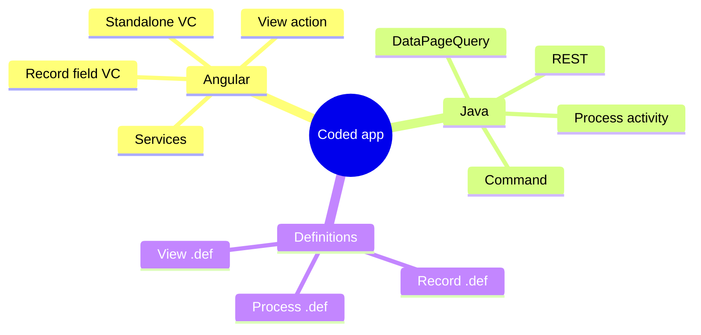
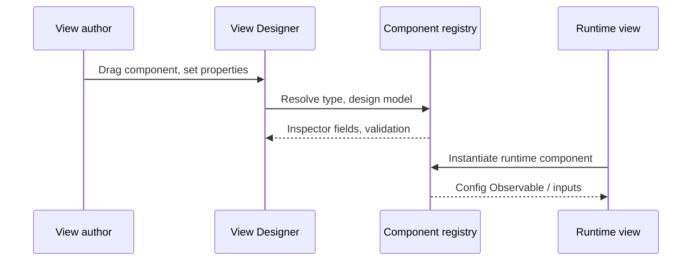
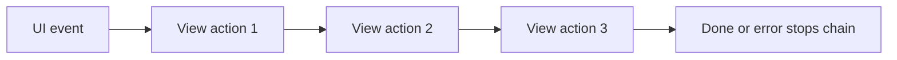
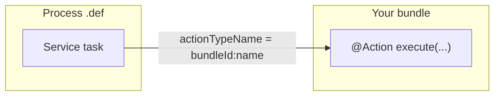
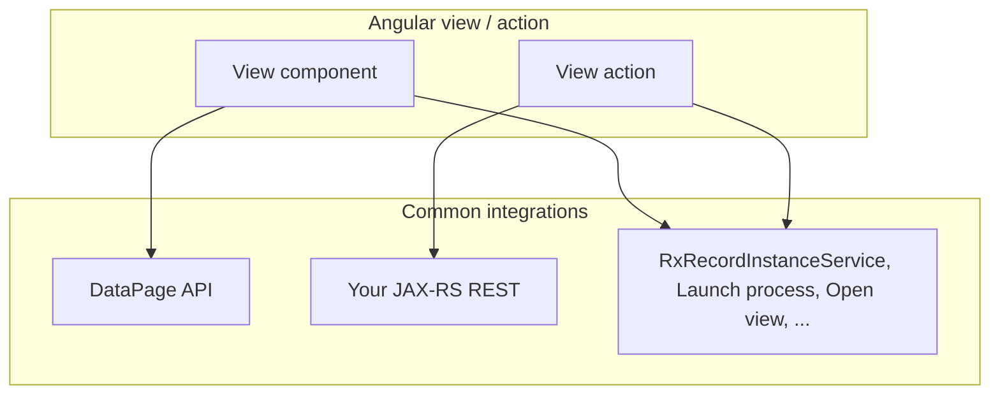
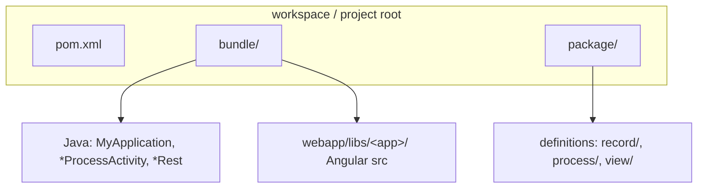

<!--
  @generated
  @context User requested a learning tutorial for BMC Helix Innovation Studio; links to Cursor prompts, composite examples, linking-view-actions-to-buttons, expression-filtered-record-list.
  @decisions Lives under how-to-build-coded-component-examples/; mermaid diagrams; cross-links to sibling guides in this folder.
  @references cookbook/01-getting-started.md through 07-process-definitions.md, AGENTS.md
  @modified 2026-03-20
-->

# BMC Helix Innovation Studio — Coded Applications Tutorial

This guide introduces **BMC Helix Innovation Studio** from a developer’s perspective: what the platform is, which pieces you can build in code, how they fit together, and where to go next. It aligns with this repository’s [cookbook](../../cookbook/01-getting-started.md) and uses **diagrams** plus **concrete example references** (including sample code under `.cursor/_instructions/`).

---

## 1. What is Helix Innovation Studio?

**BMC Helix Innovation Studio** is a low-code / pro-code platform for building digital service management applications. **Coded applications** extend the platform with:

| Layer | Technology (this project) | You ship |
|--------|---------------------------|----------|
| **UI** | Angular 18, TypeScript, RxJS, Adapt UI | View components, view actions, Angular services |
| **Backend** | Java 17, OSGi, JAX-RS, Spring | Process activities, REST APIs, commands, custom data sources |
| **Definitions** | `.def` files | Record schemas, BPMN processes, view layouts that reference your code |

End users interact with **Innovation Studio views** (designed in View Designer). Your **Angular** code appears as draggable components and configurable actions on the canvas; your **Java** code runs inside the platform when processes run or APIs are called.

```mermaid
flowchart TB
  subgraph Users["End users"]
    U[Browser]
  end
  subgraph Platform["Helix Innovation Studio"]
    VD[View Designer / Runtime views]
    P[Process engine]
    R[Records & DataPage]
    OSGi[OSGi bundle — your JAR]
  end
  U --> VD
  VD -->|loads Angular bundle| NG[Your Angular library]
  VD -->|launch process / rules| P
  P -->|@Action services| OSGi
  NG -->|HTTP / platform APIs| R
  NG -->|REST| OSGi
```

**Takeaway:** One **coded application** is typically a Maven project that produces a bundle: **frontend** (compiled Angular) + **backend** (Java services) + **definitions** (metadata the platform imports).

---

## 2. What can you build with code?

Below is the same “menu” as [Getting Started — What Can You Build?](../../cookbook/01-getting-started.md), grouped by **where it runs**.

### 2.1 In the browser (Angular)

| Artifact | Purpose |
|----------|---------|
| **Standalone view component** | Reusable UI (dashboards, tables, custom widgets) not tied to a single record field |
| **Record editor field view component** | Custom control inside a record editor, bound to a field |
| **View action** | Logic triggered by UI events (buttons, row actions), often chained |
| **Angular service** | Shared UI logic, HTTP clients, wrappers around platform services |

### 2.2 On the server (Java, inside the bundle)

| Artifact | Purpose |
|----------|---------|
| **Process activity** (`@Action`) | Business logic invoked from BPMN / rules |
| **REST API** | Custom HTTP endpoints |
| **Command** | Fire-and-forget operations |
| **DataPageQuery** | Custom paginated data for grids and DataPage consumers |

### 2.3 As platform metadata (`.def`)

| Artifact | Purpose |
|----------|---------|
| **Record definition** | Schema for records |
| **Process definition** | BPMN workflow wiring (e.g. call your `@Action`) |
| **View definition** | Layout of views that host your components |



---

## 3. How a view component works (design time vs run time)

Every **registered** view component has **two faces**:

1. **Design component** — what authors see in View Designer (canvas + placeholder).
2. **Runtime component** — what end users see when the view runs.

Registration ties together: **type string**, **runtime class**, **design class**, **design model** (property inspector), and **properties** list.



### Example: standalone view component (pizza ordering)

The reference implementation under:

` .cursor/_instructions/UI/ObjectTypes/Examples/StandaloneViewComponent/pizza-ordering/ `

shows the usual patterns:

- **`@RxViewComponent({ name })`** on the runtime class — `name` must match the **component type** used at registration (see [Getting Started — component type string](../../cookbook/01-getting-started.md)).
- **`config: Observable<...>`** — properties from the designer flow in as an observable; subscribe with `takeUntil(this.destroyed$)` in real apps ([Best practices](../../cookbook/09-best-practices.md)).
- **`api` + `setProperty`** — optional surface so **Set property** view actions can mutate the component at runtime.

```8:40:.cursor/_instructions/UI/ObjectTypes/Examples/StandaloneViewComponent/pizza-ordering/runtime/pizza-ordering.component.ts
@Component({
  standalone: true,
  selector: 'com-example-sample-application-pizza-ordering',
  styleUrls: ['./pizza-ordering.component.scss'],
  templateUrl: './pizza-ordering.component.html'
})
@RxViewComponent({
  name: 'com-example-sample-application-pizza-ordering'
})
export class PizzaOrderingComponent extends BaseViewComponent implements OnInit, IViewComponent {
  @Input()
  config: Observable<IPizzaOrderingProperties>;

  api = {
    // This method will be called when a component property is set via the Set property view action.
    setProperty: this.setProperty.bind(this)
  };

  protected state: IPizzaOrderingProperties;

  ngOnInit() {
    super.ngOnInit();

    // Make component API available to runtime view.
    this.notifyPropertyChanged('api', this.api);

    // Subscribe to configuration property changes.
    this.config.pipe(distinctUntilChanged(), takeUntil(this.destroyed$)).subscribe((config: IPizzaOrderingProperties) => {
      // Setting isHidden property to true will remove the component from the DOM.
      this.isHidden = Boolean(config.hidden);

      this.state = { ...config };
    });
  }
```

**File layout** for a full component is documented in [UI View Components](../../cookbook/02-ui-view-components.md) (`types`, `registration.module`, `design/*`, `runtime/*`).

---

## 4. How view actions work

**View actions** are Angular **services** registered with the platform. They run in a **chain**: each action can pass output to the next; an error stops the chain.

Typical uses: button clicks, calling REST, opening views, launching processes ([UI Services](../../cookbook/04-ui-services-and-apis.md)).



### Example: calculate VAT

Reference: `.cursor/_instructions/UI/ObjectTypes/Examples/ViewAction/calculate-vat/calculate-vat-action.service.ts`

- Implements **`IViewActionService`** (or the pattern your SDK version uses).
- **`execute`** returns an **`Observable`** (often `forkJoin` of outputs).
- Output fields are exposed as Observables in the result object for the **next** action in the chain.

```15:28:.cursor/_instructions/UI/ObjectTypes/Examples/ViewAction/calculate-vat/calculate-vat-action.service.ts
  // Implements the runtime behavior of the view action.
  execute(inputParameters: ICalculateVatActionProperties): Observable<any> {
    const result: IPlainObject = {};
    const fullPrice = inputParameters.price * (1 + inputParameters.vatRate / 100);

    // Calculate VAT value based on the input parameters.
    // setting the output parameter "fullPrice".
    result['fullPrice'] = of(fullPrice);

    // Display a notification with the calculated full price.
    this.rxNotificationService.addSuccessMessage(`The full price is ${fullPrice}`);

    return forkJoin(result);
  }
```

Full file layout and registration: [UI View Actions](../../cookbook/03-ui-view-actions.md).

**View Designer:** To attach those actions to a palette **Button** (Actions → Edit actions), see [Linking view actions to buttons](./linking-view-actions-to-buttons.md).

**Expression picker on properties:** To filter a list using evaluated expressions (e.g. **Status** = `'Active'`), see [Expression-filtered record list](./expression-filtered-record-list.md) and sample code under [`my-components/expression-filtered-record-list/`](../my-components/expression-filtered-record-list/).

---

## 5. How the Java backend connects to processes

**Process activities** are Java classes with **`@Action`** methods. The **process definition** (`.def`) references them by **`actionTypeName`**: `<bundleId>:<actionName>` where `<actionName>` matches `@Action(name = "...")`.



Critical deployment rule from [Process Definitions](../../cookbook/07-process-definitions.md): deploy the **JAR first**, then **`.def`**, or you may see **ERROR 930** (action type not registered yet).

Process `.def` format is **not raw JSON** — each line in the definition block uses the `   definition     : ` prefix; see [07-process-definitions.md](../../cookbook/07-process-definitions.md) and the detailed template linked there.

Java patterns (transactions on REST only, dates as epoch millis, record field conventions) are summarized in [Java Backend](../../cookbook/06-java-backend.md) and [AGENTS.md](../../AGENTS.md).

---

## 6. How the UI talks to data and the server

At runtime, Angular code uses **platform services** (records, navigation, notifications, logging) and **HTTP** where appropriate.



Recommended starting point: [UI Services & APIs](../../cookbook/04-ui-services-and-apis.md) (service table, DataPage, REST patterns).

---

## 7. Project structure (where everything lives)

Standard layout from [Getting Started](../../cookbook/01-getting-started.md):



- **`bundleId`**: from `groupId` + `artifactId` in the bundle `pom.xml`.
- **Application name**: Angular library name in `angular.json` `projects` (SDK-managed file — do not hand-edit per cookbook).

---

## 8. Suggested learning path

1. Read [Getting Started](../../cookbook/01-getting-started.md) (bundle ID, type strings, localization, assets).
2. Skim [Best Practices](../../cookbook/09-best-practices.md) once — avoid rework later.
3. **UI track:** [View Components](../../cookbook/02-ui-view-components.md) → [View Actions](../../cookbook/03-ui-view-actions.md) → [Services & APIs](../../cookbook/04-ui-services-and-apis.md).
4. **Backend track:** [Java Backend](../../cookbook/06-java-backend.md) → [Process Definitions](../../cookbook/07-process-definitions.md).
5. **Build & deploy:** [Build & Deploy](../../cookbook/08-build-deploy.md) and [Checklists](../../cookbook/10-checklists.md).
6. **Troubleshooting:** [Troubleshooting](../../cookbook/11-troubleshooting.md) when something fails after deploy.
7. **Cursor builds:** Copy-paste prompts for every coded artifact (problem + behavior + constraints) in [Cursor prompts for coded components](./cursor-prompts-coded-components.md).
8. **Multi-artifact flows:** See [Composite coded examples](./composite-coded-examples.md) (e.g. view + REST + record create, action chains, DataPage + Java).

Hands-on examples in this repo:

| Topic | Location |
|--------|----------|
| Standalone view component | `.cursor/_instructions/UI/ObjectTypes/Examples/StandaloneViewComponent/pizza-ordering/` |
| View action | `.cursor/_instructions/UI/ObjectTypes/Examples/ViewAction/calculate-vat/` |

---

## 9. Glossary (short)

| Term | Meaning |
|------|---------|
| **Bundle** | Deployable unit: your Angular + Java packaged for the platform |
| **bundleId** | Unique id (`groupId.artifactId`) for APIs, record names, and process action types |
| **View component type** | Long kebab-style string; must match in registration, `@RxViewComponent`, and `selector` |
| **View action** | Registered service run from UI events, often in a chain |
| **Process definition** | BPMN metadata in `.def` that can call Java `@Action` services |

For more terms, see [Glossary](../../cookbook/12-glossary.md).

---

*This tutorial is an orientation layer. For step-by-step scaffolding commands (Nx schematics), templates, and edge cases, always follow the linked cookbook sections and `.cursor/_instructions/` deep dives.*
