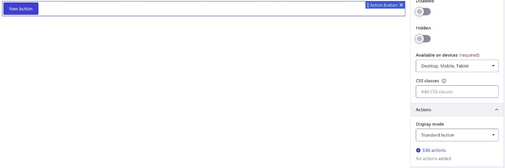
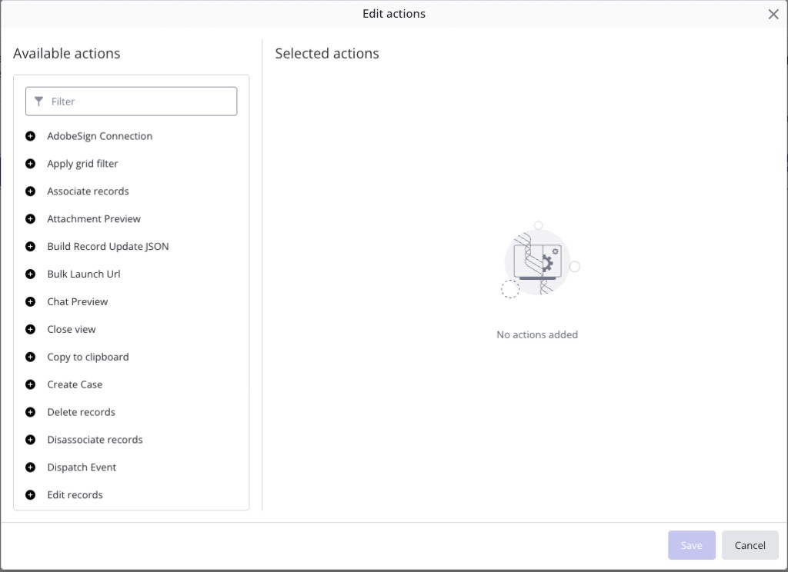

<!--
  @generated
  @context User asked how to link a view (e.g. Action button) to View Designer "Actions" / view actions; screenshots of inspector and Edit actions modal provided.
  @decisions Lives under how-to-build-coded-component-examples/ with repo-local screenshots; distinguishes platform Button vs custom coded component; links cookbook + calculate-vat example + Cursor prompt.
  @references cookbook/03-ui-view-actions.md, docs/triggering-actions-cookbook-index.md, .cursor/_instructions/UI/ObjectTypes/Examples/ViewAction/calculate-vat/
  @modified 2026-03-20
-->

# Linking view actions to a button in View Designer

In BMC Helix Innovation Studio, **view actions** are the reusable behaviors in the **Edit actions** dialog (e.g. *Close view*, *Create Case*, *Launch process*, and **your custom actions** from code). This guide explains how a **button** on a view gets wired to those actions, and what you must **code** so your custom action appears in the list.

---

## Two different “buttons” (don’t mix them up)

| Kind | Who draws the button | How actions attach |
|------|----------------------|-------------------|
| **Platform Button** (e.g. “Action button” / “New button”) | View Designer palette | **Property panel → Actions → Edit actions** (this guide) |
| **Button inside your coded view component** | Your Angular template (`adapt-button`, etc.) | You use **`(click)`** handlers in TypeScript **or** expose APIs for **Set property** / other patterns — **not** the same as the palette Button’s “Edit actions” dialog |

Your screenshots show the **platform Button** workflow. Custom **coded** standalone components do **not** automatically get the same **Edit actions** UI unless the platform treats that control as an action-capable widget; for palette buttons, the flow below is the standard path.

---

## Step-by-step: platform Button → view actions

### 1. Select the button on the canvas

Select the **Action button** (or **Button**) so the **property panel** shows on the right.

### 2. Open Actions

In the property panel, find the **Actions** section (you may need to expand it). You should see **Display mode** (e.g. *Standard button*) and a link **Edit actions**. Initially it often shows *No actions added*.



### 3. Click **Edit actions**

A modal opens:

- **Available actions** — searchable list of **platform** and **deployed custom** view actions (each row has a **+** to add).
- **Selected actions** — the **chain** that runs when the user clicks the button, **top to bottom**.



### 4. Add actions to the chain

1. Use **Filter** to find an action (e.g. *Create Case*, *Close view*, or your custom action’s **label**).
2. Click **+** on a row to move it to **Selected actions**.
3. Reorder selected actions if the platform allows drag-and-drop (order = execution order).
4. Configure each action’s **parameters** (expressions, record context, outputs from the previous step) in the inspector — exact UI varies by action type.
5. Click **Save** when enabled (you may need at least one selected action and valid required fields).

**Behavior:** At runtime the platform runs the chain **sequentially**. If one step **errors**, later steps are **skipped**. Outputs from step *N* can feed step *N+1* via the expression builder (see [Triggering actions index — §1](../docs/triggering-actions-cookbook-index.md)).

---

## Making *your* custom action show up under Available actions

Custom actions do **not** appear until they are **implemented in Angular** and **registered**, and the **bundle is deployed** to the environment where you are editing the view.

1. **Implement** a view action service and register it with `RxViewActionRegistryService` (design model + design manager for View Designer).
2. Use the **`label`** (and registration **`name`**) you set in the registration module — that text is what authors search for in **Filter**.
3. **Import** the action’s `NgModule` in your app’s main module and **export** it from `index.ts` per [View actions cookbook](../../cookbook/03-ui-view-actions.md).
4. **Build and deploy** the application; refresh View Designer if the action list is cached.

**Reference implementation (full file set):**  
`.cursor/_instructions/UI/ObjectTypes/Examples/ViewAction/calculate-vat/`

**Cookbook:** [03-ui-view-actions.md](../../cookbook/03-ui-view-actions.md)

---

## Related docs

| Topic | Doc |
|--------|-----|
| Chains, when to use designer vs code | [Triggering actions — cookbook index](../docs/triggering-actions-cookbook-index.md) |
| Single-artifact prompt to generate an action | [Cursor prompts — View action](./cursor-prompts-coded-components.md#3-view-action) |
| Composite flows (button → your action → REST, etc.) | [Composite coded examples](./composite-coded-examples.md) |
| Custom component + same “Edit actions” goal | [Custom VC + designer-configured actions](./custom-view-component-with-designer-configured-actions.md) |

---

## Cursor / Agent prompt (custom action + use on Button)

Use this after your action exists and builds; View Designer wiring is still manual (steps above).

```text
We use BMC Helix Innovation Studio coded apps (Angular 18, cookbook in repo).

Read:
- @cookbook/03-ui-view-actions.md
- @how-to-build-coded-component-examples/linking-view-actions-to-buttons.md
- @.cursor/_instructions/UI/ObjectTypes/Examples/ViewAction/calculate-vat/

Task: Implement and register a new view action `<your-action-name>` with label "<Human readable label for View Designer list>" so it appears under Available actions in Edit actions on a Button. Parameters: <list>. Outputs: <list>. Follow project patterns for module import/export and localization.

After implementation, add a short comment in the action module file with the exact registration `name` and `label` authors should search for in the Filter box.
```

---

## Troubleshooting

| Symptom | Things to check |
|---------|-------------------|
| Custom action never appears in **Available actions** | Bundle deployed? Action module imported in main app module? Correct server/environment? Typo in registration? |
| **Save** stays disabled in **Edit actions** | Required parameters missing; no action in **Selected actions**; validation errors on an action’s config |
| Button does nothing at runtime | **Hidden** may be ON in inspector; **Disabled** ON; action chain empty; earlier action in chain threw |

---

*Screenshots in this doc are from the Innovation Studio View Designer UI and are for illustration; minor label changes may appear across platform versions.*
