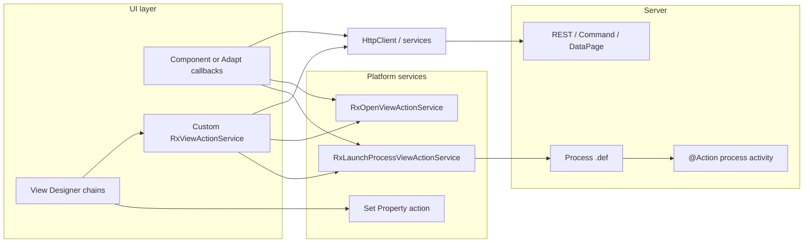

<!--
@generated
@context User requested a single reference document summarizing all cookbook-described ways to trigger actions; extended with per-type examples, how-it-works notes, and when-to-choose guidance.
@decisions Placed under docs/ with relative links to cookbook/*.md; examples follow cookbook/SDK patterns; added §10 decision matrix and anti-patterns; quick reference + §1 link to how-to-build-coded-component-examples/linking-view-actions-to-buttons.md.
@references cookbook/README.md, cookbook/01–13, .cursor/_instructions/UI/Services/open-view.md, launch-process.md, ViewAction examples
@modified 2026-03-20
-->

# Triggering actions — cookbook index

This document maps **how work gets started** in a BMC Helix Innovation Studio coded application, using the project **[cookbook](../cookbook/README.md)**. It complements platform deep-dives under `.cursor/_instructions/`.

Each major mechanism below includes **how it works**, a **minimal example**, and **when to choose it** (and when not to).

---

## Quick reference

| You want… | Cookbook starting point |
|-----------|-------------------------|
| Button / grid event → chained platform or custom logic | [03-ui-view-actions.md](../cookbook/03-ui-view-actions.md) |
| **View Designer:** Button → **Actions** → **Edit actions** (screenshots + custom actions in list) | [linking-view-actions-to-buttons.md](../how-to-build-coded-component-examples/linking-view-actions-to-buttons.md) |
| Open view / launch process from code | [04-ui-services-and-apis.md](../cookbook/04-ui-services-and-apis.md) |
| Expose properties for “Set Property” in designer | [02-ui-view-components.md](../cookbook/02-ui-view-components.md), [12-glossary.md](../cookbook/12-glossary.md) |
| Table row/column handlers in TypeScript | [05-adapt-components.md](../cookbook/05-adapt-components.md) |
| Call DataPage / records / custom REST from UI | [04-ui-services-and-apis.md](../cookbook/04-ui-services-and-apis.md) |
| BPMN process calling Java `@Action` | [07-process-definitions.md](../cookbook/07-process-definitions.md), [06-java-backend.md](../cookbook/06-java-backend.md) |
| Scope how UI reaches backend | [13-requirement-gathering.md](../cookbook/13-requirement-gathering.md) |

---

## 1. View Designer action chains (declarative)

**Source:** [03-ui-view-actions.md](../cookbook/03-ui-view-actions.md), [01-getting-started.md](../cookbook/01-getting-started.md)

### How it works

1. The author registers **view actions** (platform or custom) in Angular; they implement `execute()` and return an `Observable`.
2. In **View Designer**, a control (e.g. **Button**) is configured with an **action chain** on click (or another supported event) via **Actions → Edit actions** on the property panel. Step-by-step with screenshots: [linking-view-actions-to-buttons.md](../how-to-build-coded-component-examples/linking-view-actions-to-buttons.md).
3. The runtime executes actions **one after another** in order. Each step may read **outputs** from the previous step. If any step **errors**, the rest of the chain is **skipped**.

### Example

**Designer-only (no custom code):** On a Button, chain: **Launch process** → pass process inputs from expressions → **Show notification** on success. No TypeScript required beyond what the platform provides in the palette.

**With a custom action in the chain:** After **Calculate VAT** (custom `RxViewActionService`) returns `{ vatAmount }`, the next action might be **Set Property** on a label bound to that output—wired in the expression builder using the data dictionary.

### When to choose

| Choose this when… | Avoid or reconsider when… |
|-------------------|---------------------------|
| Business users or implementers should **change behavior without redeploying** UI code (reorder steps, swap platform actions). | Logic is **highly dynamic** inside one component (e.g. complex branching per row) — use §5 or encapsulate in one custom action. |
| You need **consistent** auditing of “what the button does” in the view definition. | You need **tight coupling** to internal component state that is **not** exposed as view-level inputs/outputs — prefer §5 or a single custom action that hides detail. |
| Multiple actions must run as a **pipeline** with shared outputs. | A single **HTTP call** or **one service call** suffices — a chain of one custom action or direct §6 is simpler. |

---

## 2. Built-in platform view action services

**Source:** [04-ui-services-and-apis.md](../cookbook/04-ui-services-and-apis.md); details in `.cursor/_instructions/UI/Services/`.

These are the same behaviors the designer can attach to chains; here you invoke them **from TypeScript** (custom view component, custom view action, etc.).

### 2a. `RxOpenViewActionService` — open a view

**How it works:** You build `IOpenViewActionParams` (presentation, `viewDefinitionName` as `<bundleId>:<view name>`, optional `viewParams`). Calling `execute(params)` returns an `Observable` that completes when the view closes, emitting **output parameters** if the view defines them. Use `catchError` for cancel/dismiss paths.

**Example** (adapted from `open-view.md`):

```typescript
import { RxOpenViewActionService } from '@helix/platform/view/actions';
import { IOpenViewActionParams } from '@helix/platform/view/actions/open-view/open-view-action.types';
import { OpenViewActionType } from '@helix/platform/view/api';
import { catchError, of } from 'rxjs';

const params: IOpenViewActionParams = {
  presentation: { type: OpenViewActionType.DockedRightModal, title: 'Order details' },
  viewDefinitionName: 'com.example.sample-application:order-details',
  viewParams: { 'first name': 'John', 'last name': 'Wick' }
};

this.rxOpenViewActionService.execute(params).pipe(
  catchError(() => of(null)) // user cancelled
).subscribe((outputs) => {
  if (outputs) {
    /* use view output params */
  }
});
```

**When to choose:** Drill-down from a **custom component** (card, table cell template) where the designer did not attach a button chain. **Modal vs full width** is controlled by `presentation.type`.

**When not to:** Prefer a **simple navigation** already modeled as a standard record/view link in the platform UI if that meets UX—less code to maintain.

### 2b. `RxLaunchProcessViewActionService` — run a process

**How it works:** You pass `ILaunchProcessViewActionParams`: `processDefinitionName` (`<bundleId>:<process>`), `waitForProcessCompletion` (usually `true` to read outputs), and `actionProcessInputParams`. The observable emits process **output** fields when complete.

**Example** (adapted from `launch-process.md`):

```typescript
import { RxLaunchProcessViewActionService } from '@helix/platform/view/actions';
import { ILaunchProcessViewActionParams } from '@helix/platform/view/actions/launch-process/launch-process-view-action.types';

const processParameters: ILaunchProcessViewActionParams = {
  processDefinitionName: 'com.example.sample-application:order-pizza',
  waitForProcessCompletion: true,
  actionProcessInputParams: {
    customerName: 'John Doe',
    orderedPizza: 'Calzone',
    quantity: 1
  }
};

this.rxLaunchProcessViewActionService.execute(processParameters).subscribe((response) => {
  const orderId = response['orderId'];
});
```

**When to choose:** The work is already modeled as a **BPMN process** (audit trail, multi-step, rules, human tasks). Trigger from code when the entry point is **inside** a custom widget.

**When not to:** A **single REST endpoint** or **one Java `@Action`** called synchronously is enough—avoid process overhead (see §7 vs §8).

### 2c. Other platform services (notifications, records, modals)

**How it works:** Inject `RxNotificationService`, `RxRecordInstanceService`, `RxModalService`, `AdaptModalService`, etc., and call them from event handlers or from inside a custom view action’s `execute()`.

**Example:**

```typescript
// After a successful save in a custom action or component
this.rxNotificationService.addSuccessMessage('Record saved');
```

**When to choose:** **Cross-cutting UX** (toasts, confirm dialogs) or **record CRUD** that should stay on the **current** view without opening another definition.

---

## 3. Custom view actions (`RxViewActionRegistryService`)

**Source:** [03-ui-view-actions.md](../cookbook/03-ui-view-actions.md); full sample: `.cursor/_instructions/UI/ObjectTypes/Examples/ViewAction/calculate-vat/`.

### How it works

1. Implement `RxViewActionService` with `execute(params): Observable<any>`.
2. Register in an `NgModule` constructor with `RxViewActionRegistryService.register({ name, label, service, designManager, designModel, parameters, output })`.
3. Import that module in the app library module and **export** from `index.ts`.

The action appears in View Designer like a built-in action and participates in **chains** (§1).

### Example (shape from cookbook)

```typescript
@Injectable()
export class CalculateVatActionService implements RxViewActionService {
  execute(params: ICalculateVatParams): Observable<{ vatAmount: number }> {
    const vat = Number(params.netAmount) * 0.2;
    return of({ vatAmount: vat });
  }
}
```

### When to choose

| Choose | Avoid |
|--------|--------|
| Logic should be **reused across many views** and configured in the **inspector** (parameters with expressions). | Logic is **private** to one component and never reused—§5 keeps code local. |
| Non-developers should **wire** this step in a chain next to platform actions. | You only need a **thin wrapper** around one HTTP call that no one reconfigures—optional §6 from a button handler is fine. |
| You want **outputs** in the data dictionary for the next chain step. | Heavy state machine—consider a **process** (§7) or dedicated **service** in the component. |

---

## 4. “Set Property” on another component

**Source:** [12-glossary.md](../cookbook/12-glossary.md), [02-ui-view-components.md](../cookbook/02-ui-view-components.md)

### How it works

1. In the **design manager**, you register **settable** properties via `setSettablePropertiesDataDictionary` (and optionally `setCommonDataDictionary` for expressions).
2. At runtime, a platform **Set Property** view action (in a chain) targets **another component instance** by name and sets one of those properties.

### Example (design-time registration)

```typescript
sandbox.setSettablePropertiesDataDictionary(name, [
  { label: 'Title', expression: this.getExpressionForProperty('title') },
  { label: 'Hidden', expression: this.getExpressionForProperty('hidden') }
]);
```

**Runtime:** In View Designer, an action chain: **Button click** → **Set Property** → target component `SummaryCard`, property `title`, value expression `=RecordGrid.selectedRow.536870913`.

### When to choose

| Choose | Avoid |
|--------|--------|
| **Loose coupling** between widgets on the same view (dashboard tiles, panels). | Many tightly related fields—prefer **one** parent component with **inputs** or a **small state service** instead of many Set Property hops. |
| Designers must **retheme** or **toggle visibility** without code changes. | Frequent updates every keystroke—Set Property in long chains can be harder to reason about than **binding** through a shared observable/signal in §5. |

---

## 5. In-component and Adapt handlers (no view-action registration)

**Source:** [05-adapt-components.md](../cookbook/05-adapt-components.md)

### How it works

- **Adapt table:** `rowLevelActionsConfig` / `columnLevelActionsConfig` supply `action: (params) => void` callbacks with row/column context.
- **Buttons / controls:** Standard Angular `(click)` or output events call methods that invoke `HttpClient`, platform services, or local state.

Execution is **outside** the view-action registry unless you explicitly call `RxLaunchProcessViewActionService` etc.

### Example (row actions)

```typescript
rowLevelActionsConfig: {
  actions: [
    { label: 'Edit', action: (p) => this.openEditor(p.dataItem) },
    { label: 'Delete', action: (p) => this.confirmDelete(p.dataItem) }
  ]
}
```

### When to choose

| Choose | Avoid |
|--------|--------|
| Behavior is **specific to this component** and should not appear in the global action palette. | Same operation must be triggered from **many** different views with identical config—consider §3. |
| You need **full TypeScript** control (complex guards, debouncing, component signals). | You need **no-code** changes by admins—prefer §1 + §3. |

---

## 6. HTTP / REST from the UI (`HttpClient`)

**Source:** [04-ui-services-and-apis.md](../cookbook/04-ui-services-and-apis.md)

### How it works

Any component or custom view action injects `HttpClient`, sets headers (`Content-Type`, `X-Requested-By`), and calls platform or custom URLs. Subscriptions should use `takeUntil(this.destroyed$)` per project standards.

### Example (DataPage query — abbreviated)

```typescript
const payload = {
  values: {
    dataPageType: 'com.bmc.arsys.rx.application.record.datapage.RecordInstanceDataPageQuery',
    pageSize: '50',
    startIndex: '0',
    recorddefinition: 'com.example.sample-application:Ticket',
    shouldIncludeTotalSize: 'false',
    propertySelection: '1,2,7,8,379,536870913',
    queryExpression: ''
  }
};

this.http
  .post<any>('/api/rx/application/datapage', payload, { headers })
  .pipe(takeUntil(this.destroyed$))
  .subscribe((res) => (this.rows = res.data));
```

### When to choose

| Pattern | Choose when… |
|---------|----------------|
| **DataPage** | Listing/filtering records with platform query semantics. |
| **Record instance API** | Create/update/delete a record **without** going through a process. |
| **Custom Java REST** | Non-record operations, integrations, or calculations exposed as `@Path` resources. |
| **Custom DataPageQuery** | Server-side paging over a **non-standard** data source. |

**When to prefer a process (§7) instead:** You need **server-side orchestration**, compensation, or **audit** as a first-class process, or the same operation is also triggered by **rules** or other **processes**.

---

## 7. Processes (BPMN `.def`) + Java `@Action` process activities

**Source:** [07-process-definitions.md](../cookbook/07-process-definitions.md), [06-java-backend.md](../cookbook/06-java-backend.md)

### How it works

1. **Java:** A class implements `Service`; a method has `@Action(name = "myAction", …)` and `@ActionParameter` arguments; it returns a DTO with `@JsonProperty` fields.
2. **Register** the service in `MyApplication.java` **before** `registerStaticWebResource()`.
3. **Process `.def`:** A `ServiceTaskDefinition` sets `actionTypeName` to `<bundleId>:myAction` and maps process context fields to parameters and back to outputs.
4. **Trigger:** From UI via `RxLaunchProcessViewActionService` (§2b), from **rules**, or from **another process** (cookbook overview).

### Example (ServiceTask fragment — conceptual)

```json
{
  "resourceType": "com.bmc.arsys.rx.services.process.domain.ServiceTaskDefinition",
  "actionTypeName": "com.example.sample-application:myAction",
  "inputMap": [
    { "assignTarget": "inputParam", "expression": "${processContext.536870913}" }
  ],
  "outputMap": [
    { "assignTarget": "536870912", "expression": "${activityResults.<taskGuid>.output.result}" }
  ]
}
```

### When to choose

| Choose | Avoid |
|--------|--------|
| Multiple steps, **human tasks**, forks, or **reuse** of the same backend action from **rules and UI**. | **One** synchronous call with no workflow—use **REST** (§8) or **UI-only** logic. |
| Operations must align with **process analytics** or **corporate BPM** standards. | You are still prototyping—start with REST or a single custom view action, then extract a process when the flow stabilizes. |

**Deploy:** JAR **before** `.def` to avoid ERROR 930 ([11-troubleshooting.md](../cookbook/11-troubleshooting.md)).

---

## 8. Other Java entry points (REST, Command, DataPageQuery)

**Source:** [06-java-backend.md](../cookbook/06-java-backend.md)

### 8a. REST (`RestfulResource`)

**How it works:** JAX-RS class with `@Path`; methods return JSON. UI or integrations call `/api/<bundleId>/...`.

**Example:**

```java
@Path("tickets")
public class TicketRest implements RestfulResource {
    @GET
    @Path("/{id}")
    @Produces(MediaType.APPLICATION_JSON)
    public TicketDto getById(@PathParam("id") String id) { /* ... */ return new TicketDto(); }
}
```

**When to choose:** **External** consumers, **fine-grained** CRUD, or APIs that **do not** map cleanly to a process.

### 8b. Command

**How it works:** Fire-and-forget style operation (see `.cursor/_instructions/Java/ObjectTypes/command.md`).

**When to choose:** **Side effects** that do not need a rich response body in the UI; platform-triggered commands.

### 8c. DataPageQuery

**How it works:** Custom Java data provider returning a **DataPage**; consumed through the same DataPage API the UI uses.

**When to choose:** **Joined**, **computed**, or **external** datasets that must page like record data.

### 8d. Process activity (`@Action`)

**How it works:** Invoked primarily through **processes** (§7), not as arbitrary REST.

**When to choose:** The unit of work is a **process step** shared with **rules** and BPMN.

---

## 9. Requirement gathering: three UI ↔ backend shapes

**Source:** [13-requirement-gathering.md](../cookbook/13-requirement-gathering.md)

These are **architecture choices**, not separate Angular APIs:

| Shape | Example scenario | Typical trigger from UI |
|-------|------------------|-------------------------|
| **Direct REST** | “Save draft” hitting `TicketRest` | §6 `HttpClient` or §8a |
| **Via process** | “Submit request” runs approval BPMN | §2b or designer launch process |
| **Via DataPage** | Search grid backed by record or custom query | §6 DataPage POST |

**When to choose:** Decide **early** based on **who else** invokes the logic (only SPA vs rules vs integrations) and **transaction boundaries** (cookbook + Java rules on `@RxDefinitionTransactional`).

---

## 10. Decision matrix (summary)

| Goal | First choice | Alternative |
|------|--------------|-------------|
| Admins rearrange steps on a button | §1 designer chain | §3 custom action as a single step |
| Open another IS view from custom UI | §2a | §1 if a standard button suffices |
| Run BPMN from custom UI | §2b | §1 launch process action |
| Reusable “business step” in many views | §3 custom view action | §5 if never reused |
| Update another widget on the view | §4 Set Property | Parent state / inputs if tightly coupled |
| Table row Edit/Delete | §5 Adapt callbacks | §1 only if you expose row actions as designer-wired chains (less common) |
| Load or mutate record data | §6 platform APIs | §7 if mutation must be process-governed |
| Server workflow + rules | §7 process + `@Action` | §8a REST if no workflow |
| External system calls your logic | §8 REST | §7 if entry is always process-first |

---

## Cookbook files that do not define extra trigger mechanisms

| File | Role |
|------|------|
| [08-build-deploy.md](../cookbook/08-build-deploy.md) | Build and deploy |
| [09-best-practices.md](../cookbook/09-best-practices.md) | Coding standards |
| [10-checklists.md](../cookbook/10-checklists.md) | Review checklists |
| [11-troubleshooting.md](../cookbook/11-troubleshooting.md) | Errors and fixes (e.g. missing action type) |

---

## Mental model (diagram)



---

## Related project docs

- [Cookbook index](../cookbook/README.md)
- IDE navigation: `.cursor/rules/00-cookbook-index.mdc`
- Deep API examples: `.cursor/_instructions/UI/ObjectTypes/ViewAction/view-action.md`, `Examples/ViewAction/calculate-vat/`
