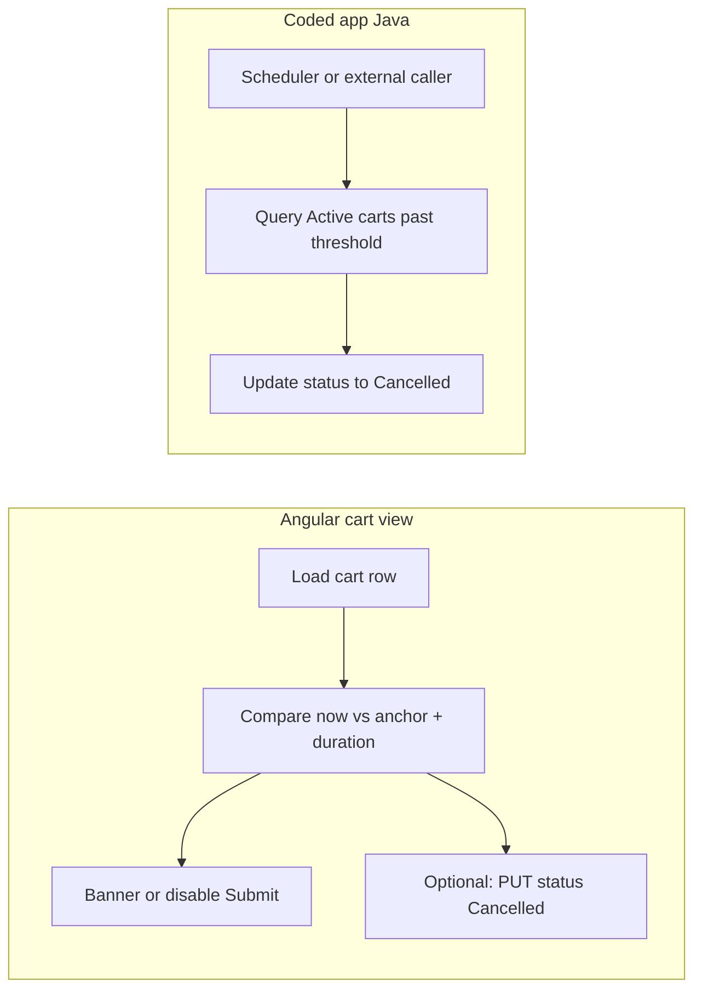

<!--
@generated
@context Plan for configurable cart session expiry (e.g. cancel cart if not submitted after N minutes); client + server enforcement per user choice.
@decisions Clock from Created (or Modified); reuse cancelled status or optional Expired value; REST + scheduler for server pass.
@references cookbook/06-java-backend.md, AGENTS.md; cart-view component paths in helix bundle workspace.
@modified 2026-03-22
-->

---
name: Cart expiry planning
overview: Add configurable cart expiry (e.g. 300 minutes) that transitions Active carts to Cancelled when not submitted, with immediate UX in the cart view plus a reliable server-side pass for enforcement when the UI is closed.
todos:
  - id: spec-anchor-status
    content: Confirm anchor field (Created vs Modified) and whether Expired differs from Cancelled in CART RD
    status: pending
  - id: inspector-props
    content: Add cart expiry inspector props (enabled, minutes, anchor, optional expired status) to types/design/registration
    status: pending
  - id: client-expiry
    content: Implement load + optional timer UX, disable submit, idempotent status write in cart-view.component.ts; extend cart property selection for fields 3/6
    status: pending
  - id: java-expire-endpoint
    content: Add secured REST + query/update Active carts past threshold; register in bundle activator
    status: pending
  - id: schedule-ops
    content: Document scheduler/job calling the endpoint (tenant-specific wiring)
    status: pending
  - id: docs-test
    content: Update cart README + manual test matrix
    status: pending
isProject: false
---

# Cart expiry duration (configurable)

## Goal

- Authors configure an **expiry duration** (example: **300 minutes**).
- If the cart is still **not submitted** when that time elapses, set **cart status** to the same **cancelled** value you already use (reuse **cancelled cart status value** in the cart inspector / `cancelledCartStatusValue` unless you want a separate “Expired” value).
- **Both** client behavior (when someone uses the cart UI) **and** a **server-side** mechanism so expiry happens even if no browser is open.

**Canonical implementation paths (repo vs bundle):**

- Tracked docs / templates: [my-components/cart-view/](./README.md).
- Built bundle UI: `workspace/helix-vibe-studio/bundle/src/main/webapp/libs/com-amar-helix-vibe-studio/src/lib/view-components/cart-view/` (mirror any code changes here when building the app).

## Concepts to lock in (product)

| Decision | Recommendation |
|----------|----------------|
| **Clock start** | **Cart record Created Date** (platform core field **3** on most forms) unless you need “last activity” — then use **Modified Date (6)** or a custom “last activity” field updated on line changes (more work). |
| **“Not submitted”** | Status is still **Active** (your **active cart status value** / expression), not the **Submitted** value. Treat **Cancelled** / **Expired** as terminal. |
| **Terminal states** | Do not expire carts already **Submitted** or already **Cancelled**. |

## Architecture (high level)

- **Client**: Fast feedback and consistent behavior when a user has the view open (warning, block submit, optionally perform the same status write as “Cancel order”).
- **Server**: Authoritative enforcement so carts expire on time without relying on the SPA.

## 1. View Designer / inspector (configuration)

Add properties on **Active cart** (same pattern as existing strings in `cart-view.types.ts` + design model + registration in the bundle cart-view):

- **`cartExpiryEnabled`** (boolean): default `false`.
- **`cartExpiryDurationMinutes`** (string or number in inspector): e.g. `300`; validate `>= 1` in design validation if you add it.
- **`cartExpiryAnchor`**: enum `'created' | 'modified'` (optional; if omitted, default **created**).
- **Status values**: Reuse existing **`cartStatusFieldId`**, **`activeCartStatusValue`** (or expression), **`cancelledCartStatusValue`** for the post-expiry write — or add **`cartExpiredStatusValue`** if you want **Expired** distinct from user-initiated **Cancelled** (clearer reporting).

Document in the cart README how expiry interacts with **Restrict cart to current user** and custodian filters.

## 2. Client (cart view runtime)

In `cart-view.component.ts` (conceptually):

- After the cart row is loaded, read **anchor timestamp** from the cart `DataRow` (field **3** or **6** per `cartExpiryAnchor`). Compare to **now** using `Date` / epoch ms (consistent with platform).
- If expired and status still Active:
  - **UX**: Show a non-dismissible message (“Cart expired…”) and **disable Submit** (and optionally **quantity** edits) to avoid race with server.
  - **Optional client write**: Call **`RxRecordInstanceService`** get/save to set status to **`cancelledCartStatusValue`** (or expired value) — **idempotent** if server already cancelled.
- **Timer**: Optional `setInterval` (e.g. every 60s) while the view is visible to flip to expired without reload; **always** `takeUntil(destroyed$)**.
- **Do not** rely on client-only for the 300-minute SLA; it is for UX and quick alignment.

Ensure **property selection** for the cart Data Page includes field **3** (and **6** if using modified anchor) so values are present — same pattern as `buildCartPropertySelection`.

## 3. Server-side (coded application Java bundle)

Per [cookbook/06-java-backend.md](../../cookbook/06-java-backend.md):

- Add a **REST resource** (e.g. `POST .../carts/expire-stale` or `GET` with admin scope) that:
  - Uses **epoch millis** for time comparisons (align with [AGENTS.md](../../AGENTS.md) backend date guidance).
  - Queries **Active** `CART` records where **anchor + duration &lt; now** and status is still Active (via platform record/AR APIs available in your bundle — exact API depends on existing project patterns; follow existing services in `bundle/src/main/java/...`).
  - For each candidate, **set status** to cancelled/expired value (same as client).
- **Invocation**: Register the service in the bundle activator (`MyApplication.java` pattern per cookbook). Schedule execution using **your org’s** supported approach (examples: **Helix / AR job**, **external scheduler** hitting the REST endpoint with a service account, or a **Process** triggered on a timer if that’s standard in your tenant). The plan is to **define the contract** (endpoint + query rules); **ops** wires the scheduler.

**Idempotency**: Running the job twice must not error if status is already terminal.

**Security**: Restrict endpoint to **admin / application** role or **internal** only so random users cannot mass-cancel carts.

## 4. Edge cases and testing

- **Timezone**: Use **UTC** internally (epoch ms) for comparisons; display local time in UI if you show a countdown.
- **Submit in flight**: Disable double-submit; if expiry triggers mid-flow, server should reject or second save is noop.
- **Catalog / other views** still pointing at an expired cart: They will see **no active cart** once status is no longer Active (same as manual cancel).
- **Tests**: Unit tests for time math; manual E2E: set duration to **1** minute in a dev view, wait, verify client banner + server job updates record.

## 5. Documentation

- Short section in cookbook or cart README: configuration, anchor field, that **server job is required** for strict expiry, and how to invoke the REST endpoint from the scheduler.

## Out of scope (unless you ask later)

- Email/notification on expiry.
- Per-user overrides or pausing the timer.
- Extending expiry on **any** cart line change (requires writes to a custom field or using Modified Date as anchor with careful definition).
