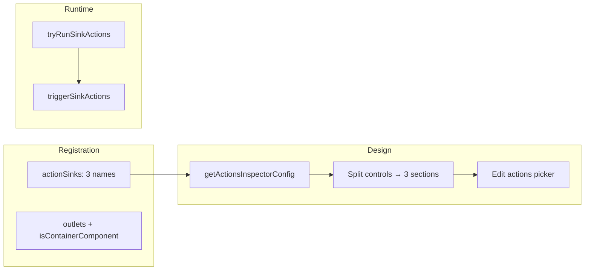

# Agent instructions: Runtime actions demo view component

One-shot prompt to build a **standalone view component** with **View Designer–configurable rx-actions** (same Edit actions picker as palette **Action button** and **Event button**). The component exposes three buttons; each button can run either a **designer-configured action chain** or a **legacy fallback** via direct service calls.

---

## Copy-paste prompt (one-shot)

```text
You are implementing a BMC Helix Innovation Studio **standalone view component** called `runtime-actions-demo` — a test harness with **three buttons** that support View Designer **Edit actions** (rx-actions), same pattern as palette **Action button** (`rx-action-button`) and **Event button** (`com-bmc-dsm-generic-shared-components-event-button`).

Read first (attach with @):
- @cookbook/02-ui-view-components.md
- @cookbook/04-ui-services-and-apis.md
- @cookbook/09-best-practices.md
- @AGENTS.md
- @.cursor/rules/generation-context-comments.mdc
- @docs/how-to-build-coded-component-examples/custom-view-component-with-designer-configured-actions.md
- @.cursor/_instructions/UI/Services/open-view.md
- @.cursor/_instructions/UI/Services/launch-process.md
- Example: @.cursor/_instructions/UI/ObjectTypes/Examples/StandaloneViewComponent/pizza-ordering/

Target location: `my-components/runtime-actions-demo/` — types, registration module, `design/` (component, html, scss, model, design types), `runtime/` (component, html, scss), `localized-strings.json`, `index.ts`.

Naming: keep **identical** across registration `type`, `@RxViewComponent({ name })`, and component `selector`. Use `com-amar-helix-vibe-studio-com-amar-helix-vibe-studio-runtime-actions-demo` (or match project’s existing component prefix).

---

## PART 1 — Rx-actions (critical; same as palette Button / Event button)

The component must support **Edit actions** in View Designer — authors add `rxOpenViewAction`, `rxLaunchProcessAction`, etc. via the **same picker** as the palette Action button. This requires:

### 1.1 Registration — `actionSinks` + `outlets` + `isContainerComponent`

In `runtime-actions-demo-registration.module.ts`, add these **alongside** `component`, `designComponent`, `designComponentModel`:

```typescript
import { RX_STANDARD_PROPS_DESC, RX_VIEW_DEFINITION } from '@helix/platform/view/api';
import { LaunchProcessViewActionModule, OpenViewActionModule } from '@helix/platform/view/actions';

@NgModule({
  imports: [OpenViewActionModule, LaunchProcessViewActionModule]
})
export class RuntimeActionsDemoRegistrationModule {
  constructor(rxViewComponentRegistryService: RxViewComponentRegistryService) {
    rxViewComponentRegistryService.register({
      type: '...',
      name: 'Runtime actions demo',
      component: RuntimeActionsDemoComponent,
      designComponent: RuntimeActionsDemoDesignComponent,
      designComponentModel: RuntimeActionsDemoDesignModel,
      isContainerComponent: true,
      outlets: [{ name: RX_VIEW_DEFINITION.defaultOutletName }],
      actionSinks: [
        { name: 'openViewActions', label: 'Open view button (actions)' },
        { name: 'launchProcessActions', label: 'Launch process button (actions)' },
        { name: 'notificationActions', label: 'Notification button (actions)' }
      ],
      properties: [ /* ... */ ]
    });
  }
}
```

- **`actionSinks`** — one sink per button; each gets its own **Edit actions** list in the inspector.
- **`isContainerComponent: true`** and **`outlets`** — required so the view tree can hold **ActionSink** children (rx-action-sink nodes).
- **OpenViewActionModule / LaunchProcessViewActionModule** — must be imported so authors can add those actions to chains.

### 1.2 Types — `actionSinks` in config

In `runtime-actions-demo.types.ts`:

```typescript
import { IActionSinkConfig, IRxStandardProps, OpenViewActionType } from '@helix/platform/view/api';

export interface IRuntimeActionsDemoProperties extends IRxStandardProps {
  name: string;
  /** Populated at runtime from view model — { name, guid } per registration actionSinks. */
  actionSinks?: IActionSinkConfig[];
  targetViewDefinitionName: string;
  targetProcessDefinitionName: string;
  demoMessage: string;
  openViewPresentationType: OpenViewActionType | string;
  openViewModalTitle: string;
  openViewParamsJson: string;
}
```

Do **not** add array properties like `openViewActions: IAction[]`. Actions are stored as **child components** (ActionSink → Actions) in the view tree, not as config arrays.

### 1.3 Design model — `getActionsInspectorConfig()` and split into sections

In `RuntimeActionsDemoDesignModel`, build inspector sections from **`sandbox.getActionsInspectorConfig()`**. That method returns controls for each `actionSinks` entry. **Split** them into **three labeled sections**:

```typescript
private setInspectorConfig(_model: IRuntimeActionsDemoProperties) {
  const sinkControls = this.sandbox.getActionsInspectorConfig().controls;

  return {
    inspectorSectionConfigs: [
      { label: 'Open view button (actions)', controls: sinkControls[0] ? [sinkControls[0]] : [] },
      { label: 'Launch process button (actions)', controls: sinkControls[1] ? [sinkControls[1]] : [] },
      { label: 'Notification button (actions)', controls: sinkControls[2] ? [sinkControls[2]] : [] },
      // ... legacy sections (targetViewDefinitionName, targetProcessDefinitionName, etc.) ...
      // ... Demo section (name, standard props) ...
    ]
  };
}
```

**CRITICAL:** Do **not** add `name: 'openViewActions'` (or similar) to any control in the action-sink sections. Those controls are **ActionSinkWidget** configs; they use the **rx-form-widget** path. If you add `name`, FormBuilderComponent treats them as **form controls** and expects `ControlValueAccessor.writeValue`, which causes `TypeError: this.instance.writeValue is not a function`. The controls from `getActionsInspectorConfig()` are already correctly configured — use them as-is.

### 1.4 Runtime — `tryRunSinkActions` and `triggerSinkActions`

The runtime component must extend **`BaseViewComponent`** (from `@helix/platform/view/runtime`), which provides `triggerSinkActions(name)` and access to `runtimeViewModelApi.getEnabledActions(guid)`.

For each button click handler:

1. Call `tryRunSinkActions(sinkName)` first.
2. If it returns `true`, the action chain was executed — return.
3. If it returns `false`, fall back to **legacy** behavior (direct service calls).

```typescript
private tryRunSinkActions(sinkName: string): boolean {
  const guid = this.state?.actionSinks?.find((s) => s.name === sinkName)?.guid;
  if (!guid) return false;
  const enabled = this.runtimeViewModelApi.getEnabledActions(guid);
  if (!enabled.length) return false;

  this.triggerSinkActions(sinkName)
    .pipe(takeUntil(this.destroyed$), catchError(() => EMPTY))
    .subscribe(() => this.cdr.markForCheck());
  return true;
}

onOpenView(): void {
  if (this.tryRunSinkActions('openViewActions')) return;
  // Legacy: RxOpenViewActionService.execute(params) when chain empty...
}
```

Same pattern for `onLaunchProcess()` → `tryRunSinkActions('launchProcessActions')` and `onShowNotification()` → `tryRunSinkActions('notificationActions')`.

---

## PART 2 — Legacy fallbacks (when action chain is empty)

When an author configures **no** actions for a sink, the buttons fall back to inspector fields:

| Button      | Legacy behavior                                                                 |
|------------|-----------------------------------------------------------------------------------|
| Open view  | `targetViewDefinitionName`, `openViewPresentationType`, `openViewModalTitle`, `openViewParamsJson` |
| Launch process | `targetProcessDefinitionName`, `demoMessage` (passed as `message` input)      |
| Notification   | Built-in success + warning toast demo                                       |

Add inspector sections **"Legacy — Open view"** and **"Legacy — Launch process"** with ExpressionFormControl for view/process names, SelectFormControl for presentation, TextFormControl for modal title, params JSON, and demo message. Use tooltips explaining these apply only when the action chain is empty.

---

## PART 3 — UI and behavior

- **Standalone:** `standalone: true`, `ChangeDetectionStrategy.OnPush`, `@if` / `@for` only.
- **Buttons:** `adapt-button` from `@bmc-ux/adapt-angular` — three buttons in a layout.
- **config:** `Observable<IRuntimeActionsDemoProperties>`; subscribe with `distinctUntilChanged` + `takeUntil(this.destroyed$)`.
- **Services:** RxOpenViewActionService, RxLaunchProcessViewActionService, RxNotificationService, RxLogService, TranslateService.
- **Logging:** RxLogService only — no `console.log`.
- **Errors:** Use `catchError` to swallow user-cancel on open view; add warning notification on process failure.
- **Design placeholder:** Short HTML explaining the three action-list pickers in the design component.

---

## PART 4 — Localization and registration properties

- `localized-strings.json` with keys for: title, button labels, success/warning messages, inspector warnings.
- Registration `properties`: `name`, `targetViewDefinitionName`, `targetProcessDefinitionName`, `demoMessage`, `openViewPresentationType`, `openViewModalTitle`, `openViewParamsJson`, plus `...RX_STANDARD_PROPS_DESC`. Use `enableExpressionEvaluation: true` for view/process names.
- Validation: warnings (not hard errors) when legacy names are empty so views stay saveable.

---

## Deliverables checklist

- [ ] `runtime-actions-demo.types.ts` — IRuntimeActionsDemoProperties with `actionSinks?: IActionSinkConfig[]`
- [ ] `runtime-actions-demo-registration.module.ts` — `actionSinks`, `outlets`, `isContainerComponent`, OpenView/LaunchProcess modules
- [ ] `design/runtime-actions-demo-design.model.ts` — `getActionsInspectorConfig().controls` split into three action sections + legacy + Demo
- [ ] `design/runtime-actions-demo-design.component.ts/html/scss`
- [ ] `design/runtime-actions-demo-design.types.ts`
- [ ] `runtime/runtime-actions-demo.component.ts` — extends BaseViewComponent, `tryRunSinkActions`, legacy fallback
- [ ] `runtime/runtime-actions-demo.component.html/scss`
- [ ] `localized-strings.json`
- [ ] `index.ts` exporting the registration module
- [ ] All files have `@generated` headers per generation-context-comments.mdc

---

## Acceptance criteria

- Component registers; builds in Helix Angular library context.
- In View Designer, inspector shows **three** "Edit actions" sections (same picker as palette Button).
- Authors can add `rxOpenViewAction`, `rxLaunchProcessAction`, etc. to each sink.
- At runtime, when a sink has actions → `triggerSinkActions` runs the chain.
- When a sink is empty → legacy path (direct service calls) runs.
- No `writeValue` / FormOutlet errors in inspector.
```

---

## Quick reference: rx-action flow



---

## Related

- [RUNTIME-ACTIONS-DEMO-ARCHITECTURE.md](./RUNTIME-ACTIONS-DEMO-ARCHITECTURE.md) — detailed architecture, diagrams, comparison with Action/Event button
- [custom-view-component-with-designer-configured-actions.md](../../docs/how-to-build-coded-component-examples/custom-view-component-with-designer-configured-actions.md) — patterns A/B/C for designer-configured actions
