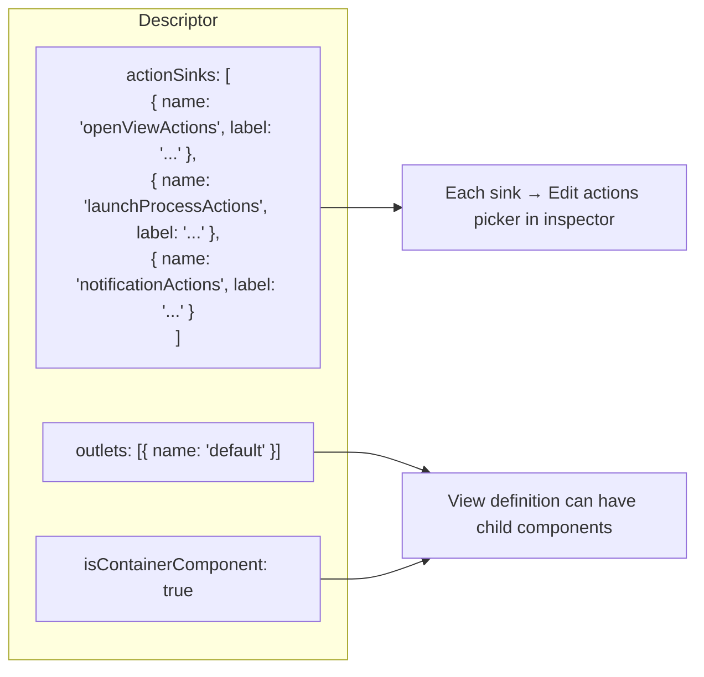
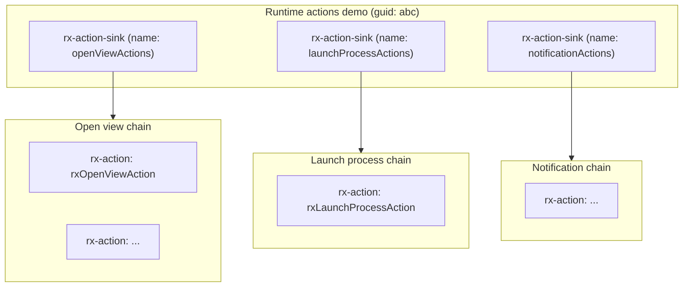
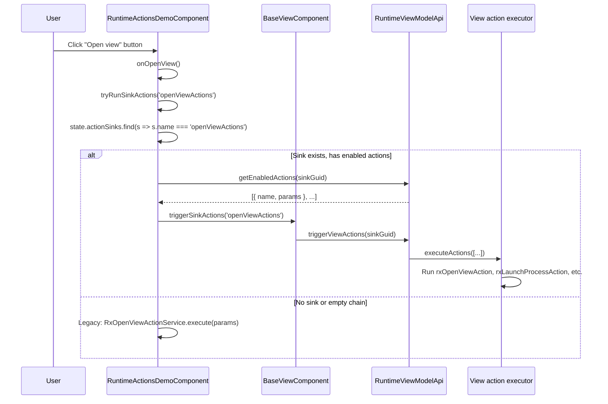

# Runtime actions demo — architecture & rx-action picker

This document explains how **Runtime actions demo** achieves **View Designer–configurable rx-actions** using the same **Edit actions** picker as the palette **Action button** (`rx-action-button`) and platform components like **Event button** (`com-bmc-dsm-generic-shared-components-event-button`). It describes the registration pattern, inspector wiring, view-definition structure, and runtime execution, with diagrams.

---

## 1. Overview

| Goal | How it works |
|------|--------------|
| **Same Edit actions UX as palette Button** | `actionSinks` on the component descriptor + `getActionsInspectorConfig()` in the design model |
| **Multiple independent action chains** | Three named sinks: `openViewActions`, `launchProcessActions`, `notificationActions` |
| **Runtime execution** | `BaseViewComponent.triggerSinkActions(name)` — same path as Action button |

The key insight: the platform **Action button** and **Event button** expose the **Edit actions** modal because they declare **`actionSinks`** on their descriptor. A custom view component that does the same gets the **identical** picker and chain storage.

---

## 2. High-level architecture

```mermaid
flowchart TB
  subgraph Registration["1. Registration (NgModule constructor)"]
    REG[RxViewComponentRegistryService.register]
    DES[Descriptor: type, component, designComponent, designComponentModel]
    AS[actionSinks: openViewActions, launchProcessActions, notificationActions]
    OUT[outlets, isContainerComponent: true]
    REG --> DES --> AS
    REG --> OUT
  end

  subgraph DesignTime["2. Design time (View Designer)"]
    INSP[Inspector: sandbox.getActionsInspectorConfig]
    SECT[Three sections: one per sink]
    PICKER[Edit actions picker — same as palette Button]
    INSP --> SECT --> PICKER
  end

  subgraph ViewDef["3. View definition (saved JSON)"]
    VC[Runtime actions demo component]
    AS1[rx-action-sink: openViewActions]
    AS2[rx-action-sink: launchProcessActions]
    AS3[rx-action-sink: notificationActions]
    A1[rx-action children]
    A2[rx-action children]
    A3[rx-action children]
    VC --> AS1 --> A1
    VC --> AS2 --> A2
    VC --> AS3 --> A3
  end

  subgraph Runtime["4. Runtime (user clicks button)"]
    BTN[adapt-button click]
    TRY[tryRunSinkActions(sinkName)]
    CHK[getEnabledActions(sinkGuid) > 0?]
    TRIG[triggerSinkActions(name)]
    EXEC[Platform executes action chain]
    BTN --> TRY --> CHK -->|yes| TRIG --> EXEC
    CHK -->|no| LEG[Legacy path: RxOpenView / LaunchProcess / Notification service]
  end

  Registration --> DesignTime
  DesignTime --> ViewDef
  ViewDef --> Runtime
```

---

## 3. Registration: mirroring Action button / Event button

The **palette Action button** and **Event button** both register with:

- `actionSinks` — array of `{ name, label }` (one sink = one “Edit actions” list)
- `isContainerComponent: true` + `outlets` — so the view tree can hold **child** components

**Runtime actions demo** does the same:



**Code:** `runtime-actions-demo-registration.module.ts`:

```typescript
rxViewComponentRegistryService.register({
  type: 'com-amar-helix-vibe-studio-...',
  name: 'Runtime actions demo',
  component: RuntimeActionsDemoComponent,
  designComponent: RuntimeActionsDemoDesignComponent,
  designComponentModel: RuntimeActionsDemoDesignModel,
  isContainerComponent: true,
  outlets: [{ name: RX_VIEW_DEFINITION.defaultOutletName }],
  actionSinks: [
    { name: 'openViewActions', label: 'Open view button (actions)' },
    { name: 'launchProcessActions', label: 'Launch process button (actions)' },
    { name: 'notificationActions', label: 'Notification button (actions)' }
  ],
  properties: [ /* legacy fields + standard props */ ]
});
```

---

## 4. Inspector: using `getActionsInspectorConfig()`

The **palette Button**’s design model uses `getActionsInspectorConfig()` from the component sandbox. That method reads `descriptor.actionSinks` and builds one section per sink, each with an **ActionSinkWidget** (the control that shows **Edit actions**).

**Runtime actions demo** reuses the same config but **splits** it into **three labeled sections**:

```mermaid
flowchart TB
  SANDBOX[sandbox.getActionsInspectorConfig]
  RET[Returns: label: 'Actions', controls: [c0, c1, c2]]
  SPLIT[Split controls into 3 sections]
  SEC1["Open view button (actions)" → controls: [c0]]
  SEC2["Launch process button (actions)" → controls: [c1]]
  SEC3["Notification button (actions)" → controls: [c2]]
  SANDBOX --> RET --> SPLIT --> SEC1
  SPLIT --> SEC2
  SPLIT --> SEC3
```

**Why split?** So authors see three clearly labeled sections (Open view, Launch process, Notification) instead of one generic “Actions” section. The underlying controls are identical to the palette Button.

**Code:** `runtime-actions-demo-design.model.ts`:

```typescript
private setInspectorConfig(_model: IRuntimeActionsDemoProperties) {
  const sinkControls = this.sandbox.getActionsInspectorConfig().controls;
  return {
    inspectorSectionConfigs: [
      { label: 'Open view button (actions)', controls: sinkControls[0] ? [sinkControls[0]] : [] },
      { label: 'Launch process button (actions)', controls: sinkControls[1] ? [sinkControls[1]] : [] },
      { label: 'Notification button (actions)', controls: sinkControls[2] ? [sinkControls[2]] : [] },
      // ... legacy sections ...
    ]
  };
}
```

**Important:** Each control is an **ActionSinkWidget** config (no `name`, only `widgetName`). That keeps it on the **rx-form-widget** path, not **rx-form-outlet** (which expects ControlValueAccessor and caused the earlier `writeValue` error).

---

## 5. View definition structure (saved when author clicks Save)

When the author adds rx-actions via **Edit actions**, the platform persists:

- **ActionSink** children under the component (one per sink name)
- **Action** children under each ActionSink (the configured chain)



At runtime, the platform’s **buildComponentConfig** merges `actionSinks: [{ name, guid }, ...]` into the component’s config so the runtime can call `triggerSinkActions(name)`.

---

## 6. Runtime execution flow



**Code:** `runtime-actions-demo.component.ts`:

```typescript
private tryRunSinkActions(sinkName: string): boolean {
  const guid = this.state?.actionSinks?.find((s) => s.name === sinkName)?.guid;
  if (!guid) return false;
  const enabled = this.runtimeViewModelApi.getEnabledActions(guid);
  if (!enabled.length) return false;

  this.triggerSinkActions(sinkName)
    .pipe(takeUntil(this.destroyed$), catchError(() => EMPTY))
    .subscribe(() => this.cdr.markForCheck());
  return true;
}
```

---

## 7. Comparison with Action button and Event button

| Aspect | Palette Action button | Event button (com-bmc-dsm-...) | Runtime actions demo |
|--------|------------------------|--------------------------------|----------------------|
| **actionSinks** | Yes (single or multiple) | Yes | Yes — 3 named sinks |
| **Edit actions picker** | Built-in via getActionsInspectorConfig | Same | Same — split into 3 sections |
| **View tree** | Button → ActionSink → Actions | Same | VC → 3 ActionSinks → Actions |
| **Runtime trigger** | triggerViewActions(buttonGuid) | triggerSinkActions(name) | triggerSinkActions(name) |
| **Legacy fallback** | N/A | N/A | Yes — legacy fields when sink empty |

The **Event button** pattern is the closest: it exposes multiple action sinks (e.g. primary, secondary) and uses the same **ActionSinkWidget** + **Edit actions** modal. Runtime actions demo generalizes that to **three** sinks with explicit labels and legacy fallbacks.

---

## 8. Data flow summary

```mermaid
flowchart LR
  subgraph Design["Design time"]
    D1[Descriptor.actionSinks]
    D2[getActionsInspectorConfig]
    D3[ActionSinkWidget per section]
    D4[Author: Edit actions → add rxOpenViewAction, etc.]
    D1 --> D2 --> D3 --> D4
  end

  subgraph Persist["Persistence"]
    P1[View definition JSON]
    P2[Component + ActionSink children + Action children]
    D4 --> P1
    P1 --> P2
  end

  subgraph Runtime["Runtime"]
    R1[config$ includes actionSinks: [{ name, guid }]]
    R2[User clicks button]
    R3[tryRunSinkActions → triggerSinkActions]
    R4[Platform executes chain]
    P2 --> R1
    R1 --> R2 --> R3 --> R4
  end

  Design --> Persist --> Runtime
```

---

## 9. File reference

| File | Role |
|------|------|
| `runtime-actions-demo-registration.module.ts` | `actionSinks`, `outlets`, `isContainerComponent` |
| `runtime-actions-demo-design.model.ts` | `getActionsInspectorConfig()` → 3 labeled sections |
| `runtime-actions-demo.component.ts` | `tryRunSinkActions()` + legacy services |
| `runtime-actions-demo.types.ts` | `actionSinks?: IActionSinkConfig[]` in config |

---

## 10. Related docs

| Topic | Location |
|-------|----------|
| Linking view actions to buttons | [linking-view-actions-to-buttons.md](../../docs/how-to-build-coded-component-examples/linking-view-actions-to-buttons.md) |
| Custom VCs and designer-configured actions | [custom-view-component-with-designer-configured-actions.md](../../docs/how-to-build-coded-component-examples/custom-view-component-with-designer-configured-actions.md) |
| View actions (code + registration) | [cookbook/03-ui-view-actions.md](../../cookbook/03-ui-view-actions.md) |
| Runtime actions demo README | [README.md](./README.md) |
