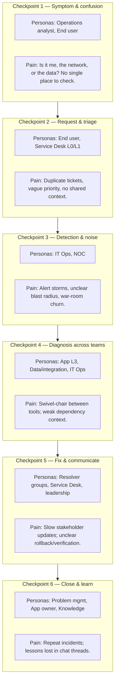
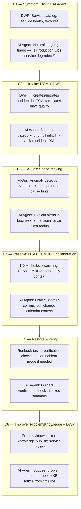

# Petronas — End-to-End Incident Management Demo Blueprint

<!--
  @generated
  @context Petronas-focused incident management demo: full persona journey, dual Mermaid workflows (pain vs. BMC Helix + AI), benefits, high-impact business service anchor.
  @decisions Anchor on Production Operations Visibility service; linear checkpoint model; AI agents called out per stage; benefits grouped by persona and platform.
  @references User request; BMC Helix DWP, ITSM, AIOps positioning.
  @modified 2025-03-21
-->

## 1. Purpose

Design a **smooth, cinematic** demo that tells a **single coherent story** from **first symptom** to **restored service and learning**, involving **every key persona** in a large enterprise. The demo must:

- Showcase **BMC Helix Digital Workplace (DWP)** as the **front door** (self-service, catalog, **AI Agent** for chat and guided resolution).
- Showcase **BMC Helix ITSM** for **structured response** (incident, tasks, collaboration, CMDB/context, change when needed).
- Showcase **BMC Helix AIOps** for **early detection**, **noise reduction**, **probable cause**, and **operational analytics**.
- **Highlight AI Agents** as **assistants** at each stage—not a replacement for process, but **accelerators** that reduce time-to-understand and time-to-act.

**Customer:** Petronas  
**Demo tone:** Confident, calm, **outcome-led** (safety, production integrity, auditability).

---

## 2. Anchor business service (high impact)

### Selected service

**Name (demo-friendly):** **Production Operations Visibility & Reporting**  
**What it is:** The **internal business service** that delivers **near–real-time production dashboards**, **deferment summaries**, and **operational KPIs** to onshore teams and leadership—sourced from offshore/onsite operational systems and data pipelines.

### Why this service for Petronas

| Criterion | Rationale |
|-----------|-----------|
| **Business criticality** | Ties directly to **production performance**, **planning**, and **stewardship** of operations. |
| **Cross-functional** | Spans **end users** (operations viewers), **service desk**, **IT**, **data/integration**, and often **vendor/partner** components. |
| **Incident realism** | Symptoms like **slow dashboards**, **stale data**, **failed extracts**, or **auth errors** are easy to stage and **explain to executives**. |
| **AIOps fit** | **Metric anomalies**, **log spikes**, and **dependency maps** map naturally to **event correlation** and **probable cause**. |
| **AI Agent fit** | Users ask natural questions: *“Is this widespread?”*, *“What changed?”*, *“What’s the workaround?”* — ideal for **guided answers** grounded in **service context**. |

> **Demo tip:** Rename catalog items and CMDB entries in your tenant to Petronas-neutral labels (e.g. “Production Ops Portal”) if required by branding guidelines.

---

## 3. Personas (who appears on screen)

| Persona | Role in the story | What they care about |
|--------|---------------------|----------------------|
| **Operations analyst (business)** | Notices wrong/stale KPIs | Correct numbers, fast answers, minimal jargon |
| **End user / requester** | Reports via DWP | One place to go, status visibility, no runaround |
| **Service Desk (L0/L1)** | Triage, communication, workaround | Clear priority, customer comms, knowledge |
| **IT Ops / SRE** | Infra health, scaling, incidents from monitoring | Fast context, fewer false alarms |
| **Application owner (L2/L3)** | App logic, releases, defects | Repro steps, blast radius, change history |
| **Data / integration owner** | Pipelines, ETL, interfaces | Job failures, dependencies, SLAs |
| **Incident commander / major incident** (optional beat) | Coordinates war room | Single timeline, tasks, exec updates |
| **Vendor / partner** (optional) | Niche component | Secure collaboration, evidence |

---

## 4. Story arc (one incident, one thread)

**Inciting event:** Users in **Kuala Lumpur** and **regional operations centers** see **stale production totals** and **missing deferment categories** for key offshore assets. Some see **intermittent timeouts**.

**Rising action:** Volume rises on the **service desk**; **AIOps** shows correlated anomalies; **ITSM** opens a **P1**, tasks fan out to **app + data + infra**.

**Climax:** **Probable cause** points to a **failed batch / integration credential rotation** (or equivalent lab-friendly root cause you configure).

**Resolution:** Fix validated, **monitoring green**, **customer communication** closed, **problem/known error** candidate logged for **preventive change**.

**Denouement:** **DWP** shows **service health**; **AI Agent** summarizes **what happened** and **how to self-check next time** (knowledge article).

---

## 5. Diagram A — Workflow, checkpoints, personas, pain points

This diagram is the **“before / friction”** view: **what breaks emotionally and operationally** if tools and process are fragmented.

### Checkpoint table (Diagram A)

| # | Checkpoint | Primary personas | Pain point (customer-visible) |
|---|------------|------------------|-------------------------------|
| 1 | Symptom & confusion | Operations analyst, End user | Unclear whether issue is local, service-wide, or data pipeline |
| 2 | Request & triage | End user, Service Desk (L0/L1) | Fragmented intake; priority and categorization inconsistent |
| 3 | Detection & noise | IT Ops, NOC | Too many alerts; hard to see **one** coherent incident |
| 4 | Diagnosis | App L3, Data/integration, IT Ops | Slow handoffs; missing **dependency / change** context |
| 5 | Fix & communicate | Resolvers, Service Desk, leadership | Status gaps; verification steps not standardized |
| 6 | Close & learn | Problem/Knowledge, App owner | Recurrence; knowledge not discoverable at the front door |

---

## 6. Diagram B — Same workflow with BMC Helix + AI Agents

This diagram maps **capabilities** to the **same checkpoints**. Adjust product labels to match your **exact SKUs/features** in scope for the meeting.

### Capability mapping table (Diagram B)

| Checkpoint | BMC Helix capability (examples) | AI Agent role (examples) |
|------------|----------------------------------|---------------------------|
| C1 | DWP: unified entry, service context | Answer **what the service is**, **who owns it**, **known issues** |
| C2 | ITSM: incident with quality intake | **Draft** title/description; **suggest** KB; **similar tickets** |
| C3 | AIOps: correlation, topology-aware insight | **Narrate** alert clusters; reduce exec jargon |
| C4 | ITSM + CMDB: tasks, relationships | **Summarize** impact; **draft** customer updates |
| C5 | ITSM: orchestration / tasks / MI | **Step-by-step** verification; **status rollup** |
| C6 | Problem, knowledge, reporting | **Propose** RCAs/KB; **self-service** deflection next time |

---

## 7. Benefits (outcomes Petronas will recognize)

### By persona

| Persona | Benefit |
|---------|---------|
| **Business operations user** | Faster clarity (**service health**, **known issues**, **self-help**) via **DWP** and **AI Agent** |
| **Service Desk** | Cleaner intake, **suggested** categorization, **faster** customer comms |
| **IT Ops** | **Fewer false positives**, faster **correlation** (**AIOps**) |
| **L3 / Data / Apps** | **Shared timeline**, **dependency context**, less swivel-chair |
| **Leadership** | **Auditability**, **single narrative**, reduced **mean time to communicate** |

### By platform theme

| Theme | Benefit |
|-------|---------|
| **Front door (DWP)** | One trusted place for **requests**, **status**, and **answers** |
| **System of action (ITSM)** | Controlled process, **SLAs**, **tasks**, **audit trail** |
| **Operational AI (AIOps)** | Earlier detection, **context**, not just more dashboards |
| **AI Agents** | **Acceleration** where humans still decide—triage, comms, knowledge |

---

## 8. Demo choreography (smooth “wow” sequence)

Use **one browser profile** and **pre-staged data** so clicks feel inevitable.

| Minute | Beat | What to show |
|--------|------|----------------|
| 0–2 | Hook | Business user notices **stale KPIs**; opens **DWP** |
| 2–5 | AI Agent | Ask: *“Is Production Ops reporting degraded?”* → **service context + suggested next step** |
| 5–8 | Intake | Create/update **incident** with **clean categorization** |
| 8–12 | AIOps | Show **anomaly / correlated events** tied to same service/time window |
| 12–18 | ITSM | **Tasks** to App/Data/Infra; **CMDB** link; **customer-facing note** drafted with AI |
| 18–22 | Restore | Runbook steps; **verification**; major incident optional |
| 22–25 | Close | **Problem/Knowledge**; **DWP** deflection proof |

**Wow factors to rehearse:**

1. **One narrative** from **business symptom** to **technical cause**—no “tool hop” monologue.  
2. **AI Agent** always **grounded** in **service** and **ticket context** (not generic chat).  
3. **AIOps** explains **why** the noise collapsed into **one** incident.  
4. Close with **measurable** outcomes: **MTTR**, **customer updates**, **recurrence prevention**.

---

## 9. Optional Petronas tailoring (talk track)

- Emphasize **operational integrity** and **stewardship**: production visibility is not “just another app”—it supports **decisions** with **regulatory and operational** consequences.  
- Keep vendor names and asset names **generic** in public decks unless approved.

---

## 10. Next steps (prep checklist)

- [ ] Register **Production Operations Visibility & Reporting** as a **business service** in CMDB (demo data).  
- [ ] Create **catalog** item + **service offering** in DWP with **AI Agent** knowledge scope.  
- [ ] Pre-build **1 P1 scenario** with **matching AIOps** events and **clear root cause**.  
- [ ] Script **5–7 AI Agent prompts** that always succeed in the lab.  
- [ ] Assign **named personas** to login accounts for a **role-based** walkthrough.

---

*Document version: 1.0 — Demo design only; implementation details depend on tenant configuration and licensed capabilities.*
