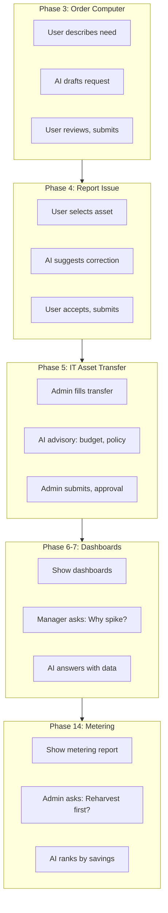

# Petronas ITAM Demo — Agentic AI Use Cases (Strategic Integration)

<!--
  @generated
  @context Agentic AI use cases for Petronas ITAM demo; where and how to strategically inject AI into the demo flow.
  @decisions Map to existing phases; tools/ICAs similar to Change Agent pattern; advisory-only where human decides.
  @references PETRONAS-ITAM-FULL-DEMO-GUIDE.md; my-change-ai-agent patterns.
  @modified 2025-03-21
-->

This document suggests **agentic AI use cases** you can build and **where to inject them** in the Petronas ITAM demo. Each use case is designed to show AI **adding value** at the right moment—without breaking the story flow.

---

## 1. Strategic Placement Overview

| Demo Phase | AI Use Case | Wow Factor | Build Effort |
|------------|-------------|------------|--------------|
| **Phase 3** (Order Computer) | **Request Draft Assistant** | AI pre-fills request from natural language | Medium |
| **Phase 4** (Report Issue) | **Asset Correction Suggester** | AI suggests likely correction based on CMDB patterns | Low |
| **Phase 5** (IT Asset Transfer) | **Transfer Advisory Agent** | AI recommends transfer path + approval impact | Medium |
| **Phase 6–7** (Dashboards) | **Management Query Agent** | Natural language: "Why did stock-in spike last week?" | Medium |
| **Phase 8** (Expiry/Refresh) | **Proactive Refresh Advisor** | AI ranks users by expiry risk; suggests outreach order | High |
| **Phase 11** (Discovery) | **Discovery Anomaly Explainer** | AI explains unexpected discovered software | Low |
| **Phase 13** (Software requests) | **License Availability Checker** | AI checks license pool before approving installation | Medium |
| **Phase 14** (Metering) | **Reharvest Recommender** | AI identifies top reharvest candidates with savings estimate | Medium |
| **Cross-cutting** | **Asset Search Agent** | "What laptops expire in 3 months assigned to Finance?" | Low |

---

## 2. Use Case Details

### 2.1 Request Draft Assistant (Phase 3 — Order Computer)

**When to show:** Right after the user says "I need a new laptop" and before they fill the form.

**What it does:** User types in natural language: *"I need a laptop for development, 32GB RAM, for Cost Centre CC-IT-001."* The AI agent:

- Parses intent (device type, specs, cost centre)
- Calls ICAs: `Get User Profile`, `Get Cost Centre by Code`, `Get Available Models`
- Drafts the Order Computer request fields (Cost Centre, Department, justification, optional model hint)

**Demo script:**  
*"Instead of hunting for Cost Centre codes, the user just describes what they need. The AI drafts the request—they review and submit."*

**Tools needed:**

- ICA – Get User Profile (Cost Centre, Department)
- ICA – Get Cost Centre by Code
- ICA – Search catalog items by keywords

---

### 2.2 Asset Correction Suggester (Phase 4 — Report Issue with Asset)

**When to show:** When user opens Report Issue with Asset 1.0 and selects an asset with wrong data.

**What it does:** User picks asset; AI agent:

- Fetches asset details, similar assets in same Department/Location
- Suggests likely correction: *"3 other assets in your department have Cost Centre CC-001. Did you mean CC-001 instead of CC-002?"*
- Pre-fills the "correct value" field

**Demo script:**  
*"The user flags an error. The AI looks at patterns—what do similar assets have?—and suggests the fix. One click to accept."*

**Tools needed:**

- ICA – Get Asset Details
- ICA – Get Assets by Department/Location
- ICA – Get Cost Centre for Department

---

### 2.3 Transfer Advisory Agent (Phase 5 — IT Asset Transfer)

**When to show:** When ITAM Admin initiates IT Asset Transfer and selects From/To.

**What it does:** Before submit, AI agent:

- Fetches asset, current assignee, target user/dept/location
- Checks: budget impact, policy (e.g. cross-OPU rules), recent transfers for same asset
- Returns: *"Transfer is within policy. Note: Target cost centre is over budget by 12%. Consider approval delay risk."*
- Advisory only—human still approves

**Demo script:**  
*"The AI doesn't block the transfer—it advises. Budget impact, policy check, recent history. The approver gets context before clicking."*

**Tools needed:**

- ICA – Get Asset Details
- ICA – Get Cost Centre Budget / Utilization
- ICA – Get Transfer History for Asset
- (Optional) Policy rules as structured data

---

### 2.4 Management Query Agent (Phase 6–7 — Dashboards)

**When to show:** After showing the dashboards, Management asks a natural-language question.

**What it does:** Manager types: *"Why did stock-in spike last week?"* or *"Which cost centres have the highest software spend?"*

AI agent:

- Parses query
- Calls ICAs: `Get Stock-In Events`, `Get Transfers by Date`, `Get Cost by Cost Centre`
- Returns a short, evidence-backed answer with numbers

**Demo script:**  
*"Dashboards give you the numbers. The AI answers the *why* and *so what*—no report drilling required."*

**Tools needed:**

- ICA – Get Asset Events (stock-in, stock-out, transfers)
- ICA – Get Cost Spend by Cost Centre / Department
- ICA – Get Utilization Metrics

---

### 2.5 Proactive Refresh Advisor (Phase 8 — Expiry / Computer Refresh)

**When to show:** Asset Admin is about to send expiry notifications; or as a "what if" sidebar.

**What it does:** AI agent:

- Queries assets with warranty/EOL within 3 months
- For each: Assigned User, Department, last request history, similar users who already refreshed
- Ranks by "urgency" (e.g. expiring soon + no recent request)
- Suggests: *"Top 5 users to contact first: [list]. User X already has Computer Refresh Request in progress."*

**Demo script:**  
*"Instead of a flat list of expiring assets, the AI prioritizes. Who to contact first, who's already in the queue. Smarter outreach."*

**Tools needed:**

- ICA – Get Assets Expiring in N Months
- ICA – Get Open Requests by User
- ICA – Get Computer Refresh Request Status by Asset

---

### 2.6 Discovery Anomaly Explainer (Phase 11 — SAM Discovery)

**When to show:** After Discovery run; SAM Admin sees a software they don't recognize.

**What it does:** SAM Admin selects discovered software: *"What is WinRAR 6.0 and why is it on 47 laptops?"*

AI agent:

- Fetches software details, install count, devices
- (Optional) Retrieves from knowledge or web: common use case, license type
- Returns: *"WinRAR is a file compression tool. Typically classified as Shareware. Found on 47 devices; 12 in Finance. Consider: manual classification or normalization rule."*

**Demo script:**  
*"Discovery surfaces the unexpected. The AI explains what it is and whether it matters for compliance."*

**Tools needed:**

- ICA – Get Discovered Software Details
- ICA – Get Install Count by Software
- Knowledge_Retriever_Tool or AskGoogle (optional)

---

### 2.7 License Availability Checker (Phase 13 — Software Installation)

**When to show:** Approver opens Microsoft Office Installation request; before approve/reject.

**What it does:** AI agent:

- Gets request: user, device
- Calls: `Get License Pool for Product`, `Get Installed Count`, `Get Pending Installation Requests`
- Returns: *"Microsoft 365: 12 of 100 licenses used. 3 pending installations. Approve: license available."*

**Demo script:**  
*"The approver doesn't guess—the AI checks the pool. Approve with confidence."*

**Tools needed:**

- ICA – Get License Pool / Entitlement
- ICA – Get Installed Count by Product
- ICA – Get Pending Installation Requests

---

### 2.8 Reharvest Recommender (Phase 14 — Metering)

**When to show:** SAM Admin views metering report; asks *"Which licenses should I reharvest first?"*

**What it does:** AI agent:

- Fetches: installed vs used, license cost, reharvest candidates
- Ranks by potential savings
- Returns: *"Top 5: Adobe CC (8 unused, ~$680/mo), MS E5 (3 unused, ~$171/mo)..."*

**Demo script:**  
*"Metering gives you the data. The AI tells you where to reclaim first—biggest impact, fastest win."*

**Tools needed:**

- ICA – Get Metering Report (installed vs used)
- ICA – Get License Cost
- ICA – Get Reharvest Candidates

---

### 2.9 Asset Search Agent (Cross-cutting)

**When to show:** At any phase where someone needs to find assets—e.g. Phase 4 (Report Issue) or Phase 10 (Computer Return).

**What it does:** User asks: *"What laptops assigned to Finance expire in 3 months?"* or *"Show me unassigned desktops in Location KL-01."*

AI agent:

- Parses filters: department, type, expiry, status, location
- Calls: `Get Assets by Filter`
- Returns table or summary

**Demo script:**  
*"No more hunting through filters. Ask in plain language."*

**Tools needed:**

- ICA – Get Assets (with filter params: department, type, status, location, expiry range)

---

## 3. Priority for Build (Recommended Order)

| Priority | Use Case | Rationale |
|----------|----------|-----------|
| 1 | **Asset Search Agent** | Low effort; high wow; reusable |
| 2 | **Asset Correction Suggester** | Fits Phase 4; simple pattern |
| 3 | **Request Draft Assistant** | Core Phase 3 wow; medium effort |
| 4 | **Reharvest Recommender** | Strong SAM story; clear ROI |
| 5 | **Transfer Advisory Agent** | Governance angle; medium effort |
| 6 | **License Availability Checker** | Quick approval story |
| 7 | **Management Query Agent** | Needs dashboard/analytics ICAs |
| 8 | **Discovery Anomaly Explainer** | Nice-to-have; knowledge-dependent |
| 9 | **Proactive Refresh Advisor** | Highest impact; most complex |

---

## 4. Injection Points (One-Liner Scripts)

| Phase | AI Beat | One-liner |
|-------|---------|-----------|
| 3 | Before form fill | "Let's see what happens when the user *describes* what they need instead of filling fields." |
| 4 | After asset selected | "The user picked an asset with wrong data. Watch—the AI suggests the fix." |
| 5 | Before transfer submit | "Before we submit, the AI gives the approver a quick advisory." |
| 6–7 | After dashboard | "You've seen the numbers. What if Management just *asks*?" |
| 8 | Before expiry batch | "Who to contact first? The AI prioritizes." |
| 11 | On unfamiliar software | "Discovery found something unexpected. Ask the AI what it is." |
| 13 | On approval screen | "Does the approver have a license to spare? The AI checks." |
| 14 | On metering view | "Where's the biggest reharvest win? The AI ranks." |

---

## 5. Technical Pattern (Aligned with Change Agents)

- **Agent type:** On-demand, user-triggered (no auto-execution in demo)
- **Tools:** ICAs calling Helix REST / record APIs (Asset, Request, CMDB, License)
- **Output:** Advisory only—never auto-approve, auto-transfer, or auto-allocate
- **Scope:** One agent per use case, or one "ITAM Assistant" with multiple tools and mode switch

---

## 6. Demo Flow Diagram (with AI Injection)

---

*Use this document with `PETRONAS-ITAM-FULL-DEMO-GUIDE.md` to plan which AI use cases to build and when to demo them.*
