# Petronas ITAM — Full Demo Guide (Logical Sequence & Workflows)

<!--
  @generated
  @context Comprehensive ITAM demo guide: Discovery-first sequence; all customer use cases; service request workflows with diagrams.
  @decisions Start with Building CMDB via Discovery; map catalog products to workflows; Mermaid diagrams for each process.
  @references petronas-itam-demo-blueprint.md; tenant service catalog screenshot; customer use cases.
  @modified 2025-03-21
-->

This document is the **single consolidated guide** for running the Petronas ITAM demo. It covers:

1. **Logical demo sequence** — starting with **Building CMDB using automated Discovery**, then all other use cases  
2. **Service request mapping** — which catalog items to use for each workflow  
3. **Workflow breakdowns** — step-by-step with Mermaid diagrams for every process

---

## Part 1 — Demo Sequence Overview

The demo follows this **logical order** (Discovery-first, then asset lifecycle, then software):

| Phase | Use case | Service Request | Persona | Approx. time |
|-------|----------|-----------------|---------|--------------|
| **1** | Build CMDB with automated Discovery | — | ITAM/Discovery Admin | 8–10 min |
| **2** | ITAM Admin: Batch upload (laptops/printers) | — | ITAM Admin | 6–8 min |
| **3** | Laptop/Desktop Request (fulfillment workflow) | **Order Computer (Laptop/Desktop)** | End User → ITAM Admin | 8–10 min |
| **4** | End User: View assets + Report inaccuracy | **Report Issue with Asset 1.0** | End User | 5–6 min |
| **5** | Asset Transfer (user/dept/OPU/location + approval) | **IT Asset Transfer** | ITAM Admin | 6–8 min |
| **6** | Management: Asset movement dashboard | — | Management | 4–5 min |
| **7** | Management: Cost/utilization dashboard | — | Management | 4–5 min |
| **8** | Asset Admin: Expiry notification + replacement | **Computer Refresh Request** | Asset Admin | 5–7 min |
| **9** | Asset Admin: Assignment/return email | — | Asset Admin | 3–4 min |
| **10** | Computer Return workflow | **Computer Return Request** | End User / ITAM Admin | 4–5 min |
| **11** | SAM: Discovery, normalize, reconcile | — | SAM Admin | 5–6 min |
| **12** | SAM: Manual software registration | — | SAM Admin | 3–4 min |
| **13** | SAM: Software installation requests | **Adobe / McAfee / Microsoft Office / Windows Installation** | SAM Admin | 4–5 min |
| **14** | SAM: Metering + license reharvesting | — | SAM Admin | 4–5 min |
| **15** | SAM: Classification + detailed inventory | — | SAM Admin | 5–6 min |
| **16** | Asset Decommission / Disposal | **Asset Decommission**, **Asset Disposal** | ITAM Admin | 4–5 min |
| **17** | Wrap: Interactive Asset Management dashboard | — | Stakeholder | 2–3 min |

**Total:** ~75–90 minutes. Condensable by combining SAM phases.

---

## Part 2 — Service Request Mapping (from Catalog)

Use these **exact catalog items** from your tenant:

### Asset Management Request (primary for ITAM demo)

| Workflow | Service Request | Cost |
|----------|-----------------|------|
| **Laptop/Desktop Request** | **Order Computer (Laptop/Desktop)** | SGD1,550.00 |
| **Report inaccurate asset** | **Report Issue with Asset 1.0** | Free |
| **Asset Transfer** | **IT Asset Transfer** | Free |
| **Computer return** | **Computer Return Request** | Free |
| **Computer replacement (expiry)** | **Computer Refresh Request** | Free |
| **Asset decommission** | **Asset Decommission** | Free |
| **Asset disposal** | **Asset Disposal** | Free |

### Software Requests (for SAM/software demo)

| Workflow | Service Request | Cost |
|----------|-----------------|------|
| **Software installation** | Adobe Installation Request | Free |
| **Software installation** | McAfee Installation Request | Free |
| **Software installation** | Microsoft Office Installation | Free |
| **Software installation** | Windows Installation Request | Free |

### Access Request (optional for approvals demo)

| Service Request | Note |
|-----------------|------|
| VPN Access Request | Free |
| Application Access Request | Free |
| Firewall Access Request | Free |
| Shared Folder Access Request | Free — Typically takes 3 days |
| Forensic Log Access Request | Free |
| Network Device Access Request | Free |

---

### Full Catalog List (all items from tenant)

| Category | Service Request | Cost |
|----------|-----------------|------|
| Asset Management | Order Computer (Laptop/Desktop) | SGD1,550.00 |
| Asset Management | Report Issue with Asset 1.0 | Free |
| Asset Management | IT Asset Transfer | Free |
| Asset Management | Computer Refresh Request | Free |
| Asset Management | Computer Return Request | Free |
| Asset Management | Asset Decommission | Free |
| Asset Management | Asset Disposal | Free |
| Software | Adobe Installation Request | Free |
| Software | McAfee Installation Request | Free |
| Software | Microsoft Office Installation | Free |
| Software | Windows Installation Request | Free |
| Access | VPN Access Request | Free |
| Access | Application Access Request | Free |
| Access | Firewall Access Request | Free |
| Access | Shared Folder Access Request | Free |
| Access | Forensic Log Access Request | Free |
| Access | Network Device Access Request | Free |

---

## Part 3 — Workflows with Diagrams

---

### Phase 1 — Build CMDB with Automated Discovery

**Use case:** Establish single source of truth for hardware and software via Helix Discovery.

**Workflow:**

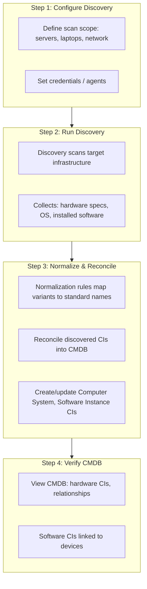

| Step | Action | Outcome |
|------|--------|---------|
| 1 | Configure Discovery scope (servers, laptops, network devices) | Scan targets defined |
| 2 | Run Discovery scan | Raw discovery data collected |
| 3 | Apply normalization rules; reconcile to CMDB | Hardware + software CIs in CMDB |
| 4 | Verify CMDB—hardware CIs, software instances, relationships | CMDB is populated; ready for ITAM |

---

### Phase 2 — ITAM Admin: Batch Upload (Laptops/Printers)

**Use case:** Asset creation via batch upload with auto-generated AssetID; linkage to Cost Centre, Users, Department.

**Workflow:**

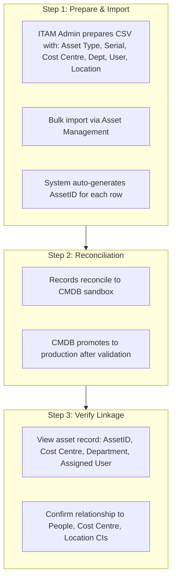

| Step | Action | Outcome |
|------|--------|---------|
| 1 | Prepare CSV; run bulk import | Auto AssetID; records created |
| 2 | Reconciliation (sandbox → production) | CMDB integrity |
| 3 | Verify Cost Centre, Department, User linkage | Traceability established |

---

### Phase 3 — Order Computer (Laptop/Desktop) — Fulfillment Workflow

**Use case:** End user requests a laptop or desktop; full lifecycle from request to deployment.

**Service Request:** **Order Computer (Laptop/Desktop)** (SGD1,550.00)

**Workflow:**

```mermaid
flowchart TB
    subgraph Step1 [Step 1: User Request]
        A1[User opens DWP catalog]
        A2[Selects Order Computer - Laptop/Desktop]
        A3[Fills required fields: Cost Centre, Department, justification]
        A4[Submits request]
    end

    subgraph Step2 [Step 2: Approval]
        B1[Request routes to Approver - Manager or ITAM]
        B2[Approver reviews and approves/rejects]
        B3[If rejected: notify user; close request]
    end

    subgraph Step3 [Step 3: Post-Approval - Work Order]
        C1[Service Request approved]
        C2[System creates Work Order - Fulfillment]
        C3[WO assigned to ITAM / Asset Admin group]
    end

    subgraph Step4 [Step 4: Fulfillment]
        D1[IT Admin opens WO]
        D2[Searches in-inventory: Asset Status = In Stock]
        D3[Finds available device; allocates to user]
        D4[Updates asset: Assigned User, Status = Assigned]
    end

    subgraph Step5 [Step 5: Notify & Schedule]
        E1[System sends notification to user with asset details]
        E2[User or Admin sets delivery appointment - date/time]
    end

    subgraph Step6 [Step 6: Delivery & Close]
        F1[Delivery completed - handover recorded]
        F2[Close Work Order - status Completed]
        F3[Mark asset Status = Deployed / In Use]
    end

    Step1 --> Step2 --> Step3 --> Step4 --> Step5 --> Step6
```

| Step | Action | Owner |
|------|--------|-------|
| 1 | User selects Order Computer (Laptop/Desktop) → submits request | End User |
| 2 | Approval workflow runs | Manager / ITAM |
| 3 | WO created post-approval | System |
| 4 | IT Admin finds in-inventory device → allocates | ITAM Admin |
| 5 | Notify user; set delivery appointment | ITAM Admin / System |
| 6 | Delivery; close WO; mark asset deployed | ITAM Admin |

---

### Phase 4 — End User: View Assets + Report Issue with Asset

**Use case:** As end user, view all assets assigned to me; if inaccurate, notify Asset Admin to correct.

**Service Request:** **Report Issue with Asset 1.0** (Free)

**Workflow:**

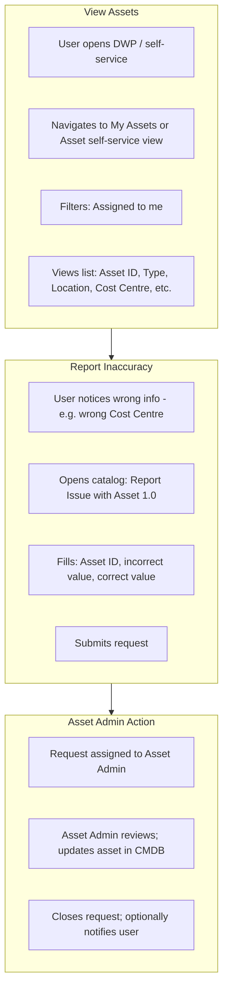

| Step | Action | Outcome |
|------|--------|---------|
| 1 | Open self-service; filter "Assigned to me" | User sees their assets |
| 2 | Submit **Report Issue with Asset 1.0** | Structured correction request |
| 3 | Asset Admin updates asset; closes request | Data quality improved |

---

### Phase 5 — IT Asset Transfer (User, Dept, OPU, Location + Approval)

**Use case:** Seamlessly manage stock, perform asset transfers, track inventory movements across locations and users. Include approval workflow.

**Service Request:** **IT Asset Transfer** (Free)

**Workflow:**

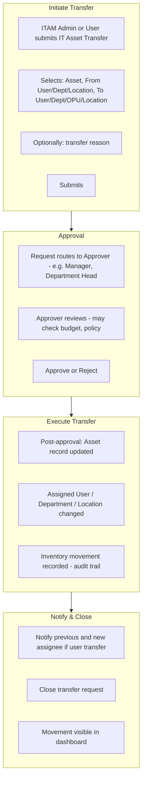

| Step | Action | Outcome |
|------|--------|---------|
| 1 | Initiate transfer (asset, from-to) | Transfer request created |
| 2 | Approval workflow | Governed movement |
| 3 | Update asset; record movement | Audit trail |
| 4 | Notify; close | Both parties informed |

---

### Phase 6 — Management: Asset Movement Dashboard

**Use case:** Interactive dashboard for real-time asset movement: stock-in, stock-out, transfers, current location.

**Workflow (viewing only):**

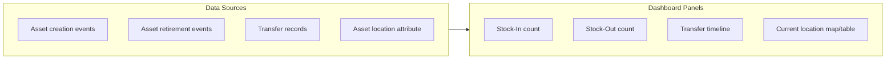

| Panel | Metric |
|-------|--------|
| Stock-In | Assets added in period |
| Stock-Out | Assets retired in period |
| Transfers | Transfer events over time |
| Current Location | Assets by site/OPU/department |

---

### Phase 7 — Management: Cost & Utilization Dashboard

**Use case:** View overall cost spend (HW & SW), utilization; plan hardware and software optimization and cost saving.

**Workflow (viewing only):**

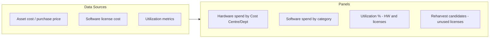

---

### Phase 8 — Asset Admin: Expiry Notification + Computer Refresh Request

**Use case:** Auto-notification for device near expiry (e.g. 3 months) with embedded link for users to set appointment (within system) to replace laptop.

**Service Request:** **Computer Refresh Request** (Free)

**Workflow:**

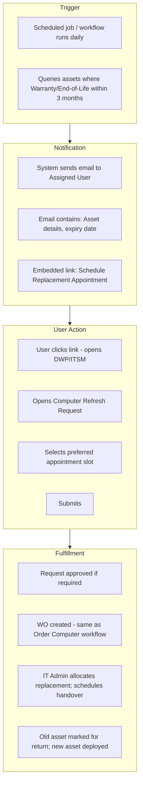

| Step | Action |
|------|--------|
| 1 | Scheduled workflow finds assets expiring in 3 months |
| 2 | Email sent with asset details + embedded link |
| 3 | User clicks link → opens replacement request |
| 4 | User selects appointment slot → submits |
| 5 | Approval (if any) → WO → allocate replacement → handover |

---

### Phase 9 — Asset Admin: Assignment/Return Email

**Use case:** Auto-generated email with asset details when asset is newly assigned or returned.

**Workflow:**

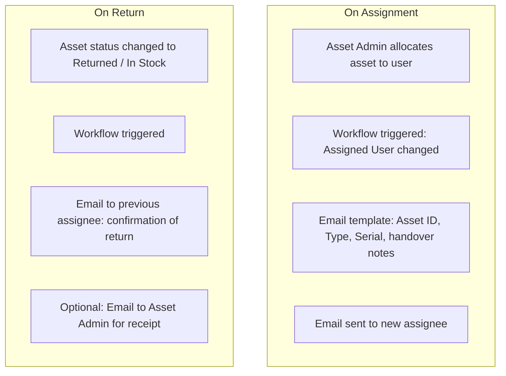

| Event | Email content |
|-------|---------------|
| **Assignment** | Asset ID, type, serial, delivery appointment link |
| **Return** | Confirmation of return; next steps |

---

### Phase 10 — Computer Return Request

**Use case:** User returns a computer (laptop/desktop); asset goes back to inventory.

**Service Request:** **Computer Return Request** (Free)

**Workflow:**

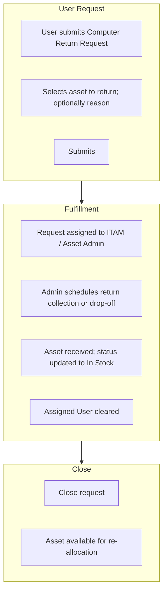

---

### Phase 11 — SAM: Discovery, Normalize, Reconcile

**Use case:** Demo how software is discovered, normalized, and reconciled.

**Workflow:**

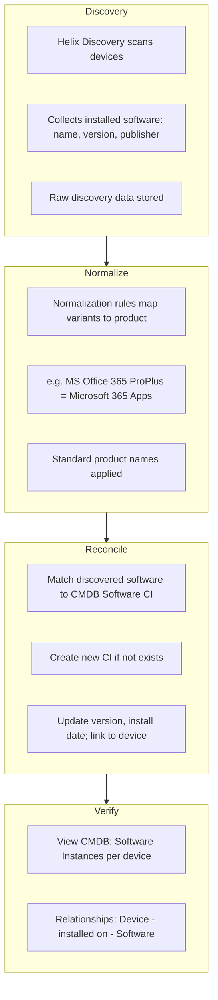

| Step | Action |
|------|--------|
| 1 | Discovery scans; collects installed software |
| 2 | Normalization rules standardize product names |
| 3 | Reconcile to CMDB; create/update Software CIs |
| 4 | Verify in CMDB |

---

### Phase 12 — SAM: Manual Software Registration (back-office)

**Use case:** Demo manual software registration for software not discovered.

**Workflow:**

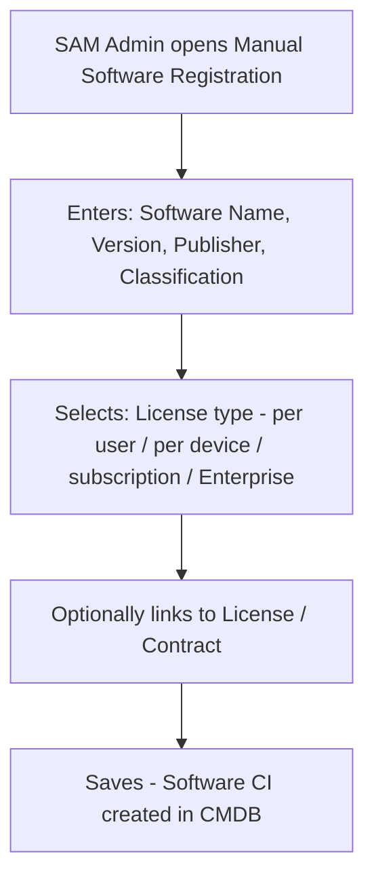

| Step | Action |
|------|--------|
| 1 | Open manual registration form |
| 2 | Enter name, version, publisher, classification |
| 3 | Select license type |
| 4 | Save → Software CI created |

---

### Phase 13 — SAM: Software Installation Requests

**Use case:** Demo software request workflow; ties to license classification and SAM inventory.

**Service Requests:** **Adobe Installation Request**, **McAfee Installation Request**, **Microsoft Office Installation**, **Windows Installation Request** (all Free)

**Workflow (example: Microsoft Office Installation):**

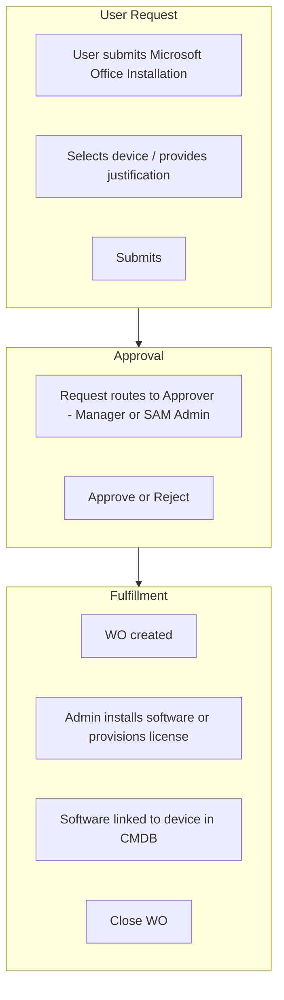

| Software Request | Use for |
|-----------------|---------|
| Adobe Installation Request | Licensed Product / subscription |
| McAfee Installation Request | Endpoint / security software |
| Microsoft Office Installation | Per-user or per-device license |
| Windows Installation Request | OS / per-device |

---

### Phase 14 — SAM: Metering + License Reharvesting

**Use case:** Software metering (actual usage vs installed); license reharvesting of unused licenses.

**Workflow:**

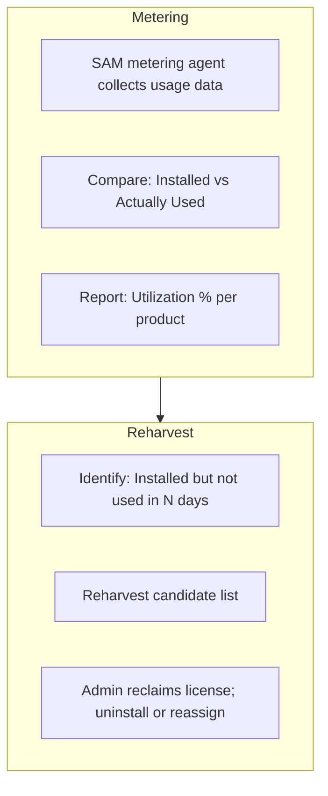

| Step | Action |
|------|--------|
| 1 | Metering compares installed vs actual usage |
| 2 | Identify reharvest candidates (unused) |
| 3 | Admin reclaims; reassigns or removes |

---

### Phase 15 — SAM: Classification + Detailed Inventory

**Use case:** View software classification (Licensed, Freeware, Shareware, Open Source, SaaS, Unauthorized) and license type; detailed inventory per device.

**Classifications:**

| Classification | Description |
|----------------|-------------|
| Licensed Product | Commercial software requiring valid license |
| Freeware | Free-to-use software |
| Shareware / Trialware | Time-limited or feature-limited |
| Open Source | Open-source licensing models |
| SaaS / Subscription | Subscription-based applications |
| Unauthorized Prohibited | Prohibited software |

**License types:** Per user, Per device, Per subscription, Enterprise agreement.

**Workflow (viewing):**

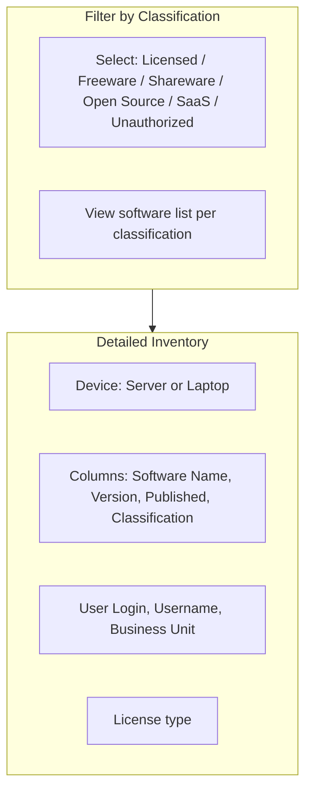

| Column | Source |
|--------|-------|
| Software Name | CMDB Software CI |
| Version | Discovery or manual |
| Published | Publisher attribute |
| Classification | SAM classification |
| User Login | Assigned user of device |
| Username | People record |
| Business Unit | Department / Cost Centre |
| License type | Per user / device / subscription / Enterprise |

---

### Phase 16 — Asset Decommission / Asset Disposal

**Use case:** Decommission or dispose of assets at end of life.

**Service Requests:** **Asset Decommission** (Free), **Asset Disposal** (Free)

**Workflow (Asset Decommission):**

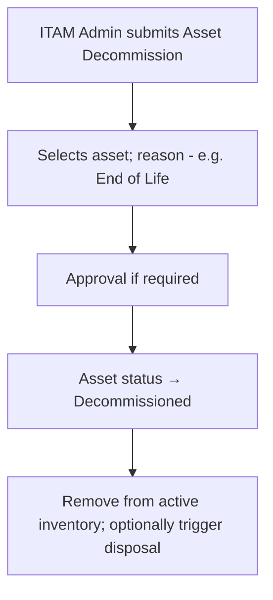

**Workflow (Asset Disposal):**

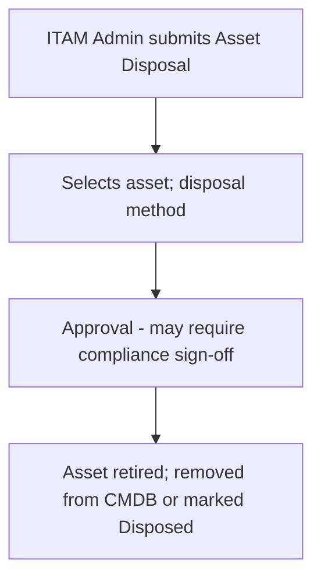

---

### Phase 17 — Wrap: Interactive Asset Management Dashboard

**Use case:** Stakeholder and Management view interactive dashboard for Asset Management.

**Content:** Summary view combining movement, cost, utilization, and key KPIs—as in Phases 7 and 8, or a dedicated Asset Management overview dashboard.

---

## Part 4 — Quick Reference: Phase → Service Request

| Phase | Service Request |
|-------|-----------------|
| 3 | **Order Computer (Laptop/Desktop)** — SGD1,550.00 |
| 4 | **Report Issue with Asset 1.0** — Free |
| 5 | **IT Asset Transfer** — Free |
| 8 | **Computer Refresh Request** — Free |
| 10 | **Computer Return Request** — Free |
| 13 | **Adobe / McAfee / Microsoft Office / Windows Installation Request** — Free |
| 16 | **Asset Decommission**, **Asset Disposal** — Free |

---

## Part 5 — Demo Preparation Checklist

- [ ] **Discovery:** Scope configured; at least one successful scan |
- [ ] **CMDB:** Cost Centres, Departments, OPUs, Locations, People |
- [ ] **Catalog:** Order Computer, Report Issue with Asset 1.0, IT Asset Transfer, Computer Refresh, Computer Return, Asset Decommission, Asset Disposal, Adobe/McAfee/Microsoft Office/Windows Installation |
- [ ] **Approval definitions:** Order Computer, IT Asset Transfer, Computer Refresh, Computer Return, Asset Decommission, Asset Disposal |
- [ ] **Workflows:** Assignment email, Return email, Expiry notification |
- [ ] **SAM:** Classifications, license types, metering (if licensed) |
- [ ] **Dashboards:** Movement, Cost/Utilization, Asset Overview |
- [ ] **Dry run:** Follow this guide; rehearse each phase |

---

*Document version: 1.0 — Single consolidated guide for Petronas ITAM demo.*
