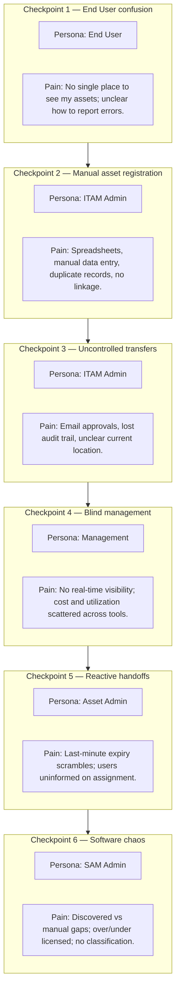
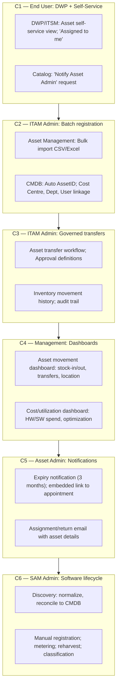

# Petronas — ITAM Demo Blueprint (ITSM, ITAM, CMDB, Discovery)

<!--
  @generated
  @context Petronas ITAM demo: full persona journey across End User, ITAM Admin, Asset Admin, SAM Admin, Management; story-driven tell-show-tell framework.
  @decisions Anchor on "new laptop batch + transfers" narrative; acts sequenced by persona; benefits grouped by persona and platform theme.
  @references User request; plan petronas_itam_demo_plan; incident blueprint pattern.
  @modified 2025-03-21
-->

## 1. Purpose

Design a **smooth, story-driven** demo that showcases **IT Asset Management (ITAM)** across **BMC Helix ITSM**, **ITAM**, **CMDB**, and **Discovery**, involving **every key persona** in an enterprise asset lifecycle. The demo must:

- Showcase **End User** self-service: view assets assigned to me; notify Asset Admin for corrections.
- Showcase **ITAM Administrator** capabilities: batch upload (printer/laptop) with auto AssetID; linkage to Cost Centre, Users, Department; stock management; asset transfers across user/dept/OPU/location with approval workflow.
- Showcase **Management & Stakeholders** dashboards: real-time asset movement (stock-in, stock-out, transfers, location); cost spend (HW/SW); utilization; optimization planning.
- Showcase **Asset Admin** automation: expiry notification (3 months) with embedded link for replacement appointment; auto-email for newly assigned/returned asset.
- Showcase **SAM Admin** capabilities: discovery, normalization, reconciliation; manual software registration; metering (usage vs installed); license reharvesting; software classification and detailed inventory.

**Customer:** Petronas  
**Demo tone:** Confident, calm, **outcome-led** (traceability, cost savings, compliance, user experience).

---

## 2. Anchor Narrative (high impact)

### Selected story

**Name (demo-friendly):** **One Day in the Life of Corporate Assets**  
**What it is:** A regional office receives new **laptops and printers**; users interact with their assigned assets; assets move between users, departments, and locations; management sees real-time visibility; Asset Admin automates handoffs and expiry scheduling; SAM Admin demonstrates software discovery through optimization.

### Why this narrative for Petronas

| Criterion | Rationale |
|-----------|-----------|
| **Business relevance** | Hardware refresh, cost attribution, and compliance are core ITAM concerns for large enterprises. |
| **Cross-persona** | Spans **End User** (view, notify), **ITAM Admin** (register, transfer), **Management** (dashboards), **Asset Admin** (notifications), **SAM Admin** (software lifecycle). |
| **Demo realism** | Batch upload, transfers, approvals, and dashboards are easy to stage with pre-loaded data. |
| **Discovery fit** | Software installed on laptops and servers maps naturally to **discovery**, **normalization**, and **reconciliation**. |

> **Demo tip:** Use Petronas-neutral labels (e.g. generic Cost Centre names, OPU codes) if required by branding guidelines.

---

## 3. Personas (who appears on screen)

| Persona | Role in the story | What they care about |
|---------|-------------------|----------------------|
| **End User** | Views assets assigned to me; flags inaccuracies | One place to see my equipment; simple way to request corrections |
| **ITAM Administrator** | Registers assets via batch; manages transfers and approvals | Speed, traceability, audit trail |
| **Management & Stakeholders** | Views dashboards (movement, cost, utilization) | Real-time visibility; planning data |
| **Asset Admin** | Configures expiry notifications; assignment/return emails | Proactive handoffs; fewer support calls |
| **SAM Admin** | Discovers, registers, meters, classifies software | Accurate inventory; license optimization |

---

## 4. Story Arc (one narrative thread)

**Inciting event:** A regional office receives a batch of **new laptops and printers**. End users expect to see what’s assigned to them and to report any errors.

**Rising action:** ITAM Admin **batch-uploads** assets with auto AssetID and linkages to Cost Centre, Department, and Users. Transfers occur between users, departments, and locations—with **approval workflow**.

**Climax:** Management views **real-time dashboards** (stock-in, stock-out, transfers, location). Asset Admin demonstrates **expiry notification** and **assignment/return email**. SAM Admin shows **discovery**, **metering**, and **classification**.

**Denouement:** All personas have **one pane of glass**—traceability, cost visibility, and compliance from asset creation to software optimization.

---

## 5. Diagram A — Workflow, checkpoints, personas, pain points

This diagram is the **“before / friction”** view: **what breaks** if asset and software management are fragmented.

### Checkpoint table (Diagram A)

| # | Checkpoint | Primary persona | Pain point (customer-visible) |
|---|------------|-----------------|------------------------------|
| 1 | End User confusion | End User | No single view of assigned assets; no clear correction path |
| 2 | Manual asset registration | ITAM Admin | Spreadsheet chaos; no Cost Centre/Department linkage |
| 3 | Uncontrolled transfers | ITAM Admin | Email approvals; lost audit trail; unclear location |
| 4 | Blind management | Management | No real-time movement; cost/utilization scattered |
| 5 | Reactive handoffs | Asset Admin | Expiry surprises; users uninformed on assignment/return |
| 6 | Software chaos | SAM Admin | Discovered vs manual gaps; overlicensed; no classification |

---

## 6. Diagram B — Same workflow with BMC Helix

This diagram maps **capabilities** to the **same checkpoints**.

### Capability mapping table (Diagram B)

| Checkpoint | BMC Helix capability (examples) |
|------------|----------------------------------|
| C1 | DWP/ITSM self-service asset view; catalog request "Notify Asset Admin" |
| C2 | Asset Management bulk import; auto AssetID; CMDB relationships (Cost Centre, Dept, User) |
| C3 | Asset transfer workflow; approval definitions; inventory movement history |
| C4 | ITSM/ITAM dashboards; optional BMC ADE / Grafana for asset movement, cost, utilization |
| C5 | Workflow/notification for expiry; ITSM request for appointment; assignment/return email |
| C6 | Helix Discovery; SAM module (manual reg, metering, reharvest, classification) |

---

## 7. Benefits (outcomes Petronas will recognize)

### By persona

| Persona | Benefit |
|---------|---------|
| **End User** | One place to see assigned assets; simple way to request corrections without calling helpdesk |
| **ITAM Administrator** | Batch upload with auto AssetID and full linkage; governed transfers with audit trail |
| **Management & Stakeholders** | Real-time visibility of asset movement; cost and utilization for planning |
| **Asset Admin** | Proactive expiry scheduling; clear assignment/return handoffs |
| **SAM Admin** | Automated discovery; manual gap-fill; metering and reharvest; classification for compliance |

### By platform theme

| Theme | Benefit |
|-------|---------|
| **Asset Management** | Traceability from creation to retirement; linkage to Cost Centre, User, Department |
| **CMDB** | Single source of truth; reconciliation from Discovery and manual sources |
| **Discovery** | Automated software inventory; normalization and reconciliation |
| **SAM** | Metering, reharvest, classification—right-size licensing, reduce spend |

---

## 8. Demo choreography (Tell-Show-Tell sequence)

Use **one browser profile** and **pre-staged data** so clicks feel inevitable.

| Act | Beat | Approx. time | What to show |
|-----|------|--------------|--------------|
| 1 | End User: view assets + notify | 5–7 min | DWP self-service; "Assigned to me"; catalog request to notify Asset Admin |
| 2 | ITAM Admin: batch upload | 6–8 min | Bulk import; auto AssetID; Cost Centre, Dept, User linkage |
| 3 | ITAM Admin: transfers + approval | 6–7 min | Transfer request; approval workflow; movement history |
| 4 | Management: movement dashboard | 4–5 min | Stock-in/out; transfers; current location |
| 5 | Management: cost/utilization | 4–5 min | HW/SW spend; utilization %; optimization |
| 6 | Asset Admin: expiry + assignment email | 5–7 min | Expiry notification with link; assignment/return email |
| 7 | SAM Admin: discovery + reconcile | 5–6 min | Discovered software; normalization; reconciliation |
| 8 | SAM Admin: manual + metering + classification | 8–10 min | Manual registration; metering; reharvest; classification; inventory |
| 9 | Wrap: Asset Management dashboard | 2–3 min | Stakeholder view |

**Total:** ~55–60 minutes.

**Wow factors to rehearse:**

1. **One narrative** from end-user view through management dashboards—no "tool hop" monologue.  
2. **Batch upload** → **transfer** → **approval** flow feels inevitable.  
3. **Tell-Show-Tell** on every beat: state benefit → demonstrate → recap outcome.

---

## 9. Optional Petronas tailoring (talk track)

- Emphasize **cost attribution** and **compliance**—especially for hardware/software across Cost Centre and OPU.  
- Keep asset and software names **generic** unless approved.

---

## 10. Next steps (prep checklist)

- [ ] **CMDB:** Cost Centres, Departments, OPUs, Locations; User records for demo personas.  
- [ ] **Assets:** Sample laptops, printers (enough for batch upload and transfers).  
- [ ] **Approval definitions:** Transfer approval workflow (user → dept → location).  
- [ ] **DWP:** Catalog item "Notify Asset Admin" linked to request/incident.  
- [ ] **Notifications:** Expiry (3 months); assignment/return email templates.  
- [ ] **Discovery:** Configured scope for software discovery; normalization rules.  
- [ ] **SAM:** Software classifications; license types; metering data.  
- [ ] **Dashboards:** Stock-in, stock-out, transfer records; cost/utilization metrics.  
- [ ] **Dry run:** Follow `petronas-itam-demo-speaker-notes.md`; fix vocabulary mismatches.

---

*Document version: 1.0 — Demo design only; implementation details depend on tenant configuration and licensed capabilities.*
